# Lab 01 - Build,publish pipelines and build multiple configuration using templates

The Tailspin Toys team has just started their DevOps journey. So far,
they've evaluated their current processes and technologies and planned
their initial set of tasks on Azure Boards.

- In this lab, you create a basic release pipeline in Azure Pipelines
  that deploys a web application to Azure App Service.

- Examine pipeline analytics to understand the health and history of
  your releases.

Objective :

- Create a basic release pipeline in Azure Pipelines that deploys a web
  application to Azure App Service.

- Examine pipeline analytics to understand the health and history of
  your releases.

## Exercise 1 - Get the sample application

Get ready to start building a CI pipeline with Microsoft Azure
Pipelines. The first step is to build and run the *Space Game* web app.
Understanding how to build software manually, prepares you to repeat the
process in the pipeline.

### Task 1 : Create an Azure DevOps personal access token

1.  Create an Azure DevOps personal access token (PAT). Open a new tab
    in your browser and navigate to - <https://portal.azure.com/> and
    sign in with assigned account.

2.  Search for **Azure DevOps** and select **Azure DevOps
    organizations**.

3.  Click on **My Azure DevOps Organization** hyper link.

4.  Click on **Create new organization** button.

5.  Click on **Continue**.

6.  Enter the organization name as : **tffabrikamXXX** (should be
    unique, replace XXX with number)enter the characters shown in your
    screen and then click on **Continue**.

7.  In the top right corner of the screen, click **User settings**.
    Click **Personal access tokens**.

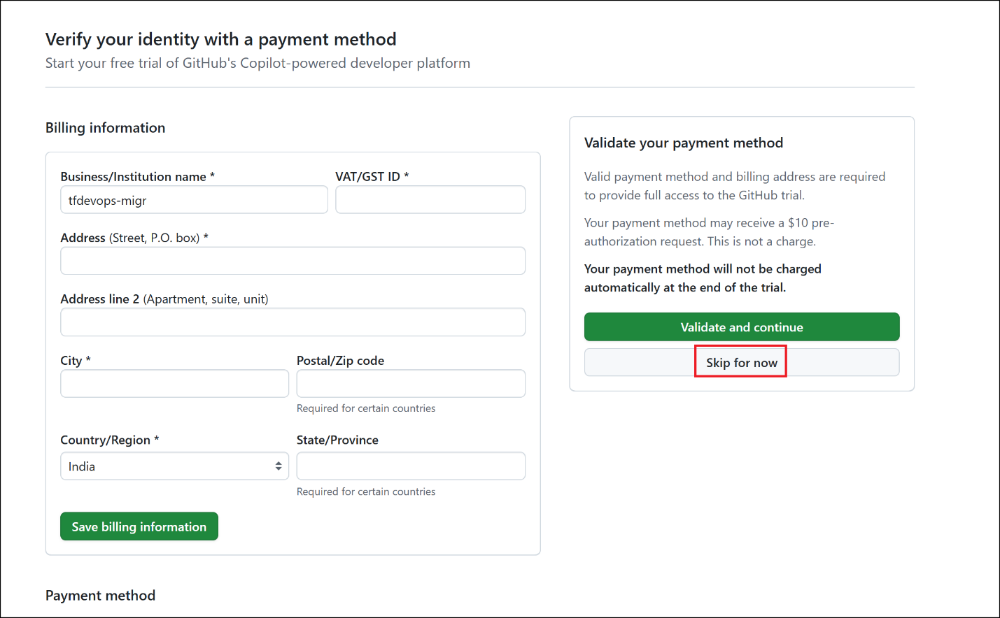

8.  Select **+ New Token**

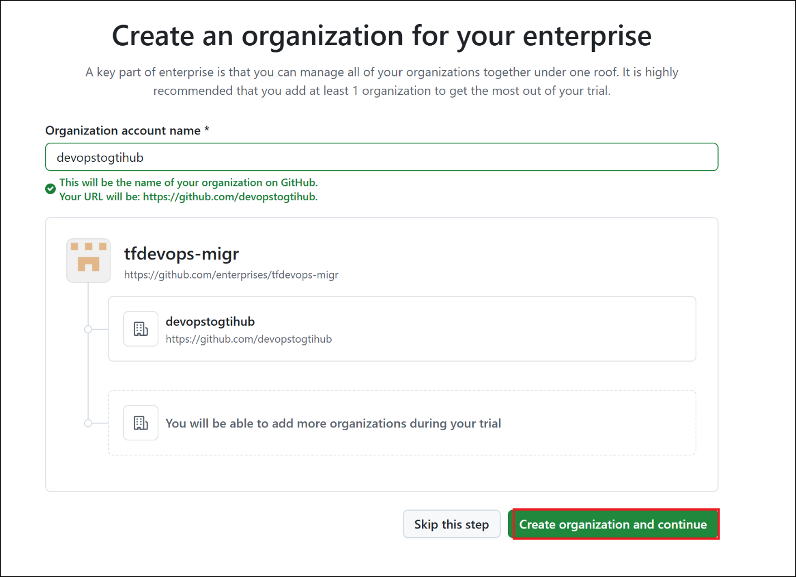

9.  Enter the name as : **devopstoken** and select the following scopes
    (you may need to select Show all scopes at the bottom of the page to
    reveal all scopes):

    - Agents Pool: **Read & write**

    - Build: **Read & execute**

    - Code: **Read, write, & manage**

    - Deployment Groups : Read & manage

    - GitHub Connections: Read & manage

    - Pipeline Resources: Use and manage

    - Project and Team: **Read, write, & manage**

    - Pull Request Threads: Read & write

    - Release: **Read, write, execute, & manage**

    - Service Connections: **Read, query, & manage**

    - Team Dashboard: Read & manage

    - Task Groups: **Read, create, & manage**

    - **Test Management: Read & write**

    - Variable Groups: **Read, create, & manage**

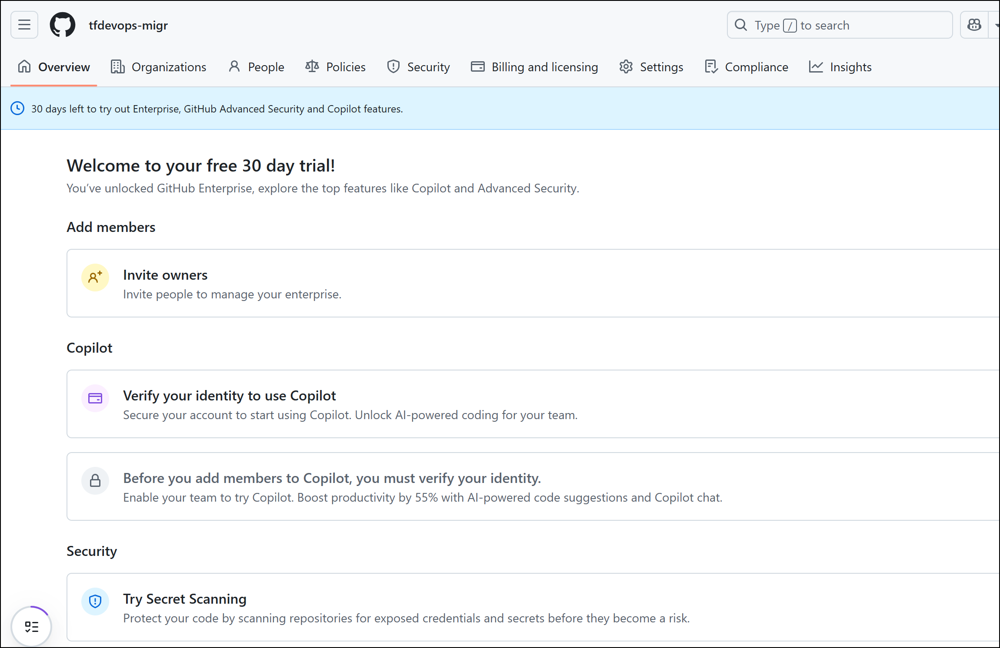

10. Copy the generated API token and save it in a safe location. For
    your security, it won't be shown again.

### Task 3 : Download and configure the agent

1.  From Left down corner, click on **Organization settings**.

2.  Choose **Agent pools**. Select the **Default** pool.

3.  Select the **Agents** tab, and choose **New agent**.

4.  On the **Get the agent** dialog box, choose **Windows**. On the left
    pane, select the processor architecture of the installed Windows OS
    version on your machine. The x64 agent version is intended for
    64-bit Windows, whereas the x86 version is intended for 32-bit
    Windows.

5.  On the right pane, click the **Download** button.

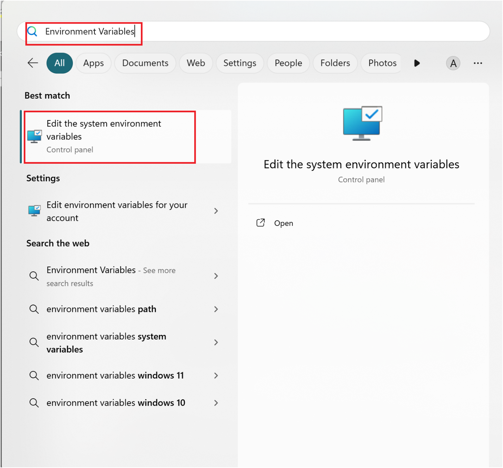

6.  Follow the instructions on the page to download the agent.

7.  Unpack the agent into the directory of your choice. Make sure that
    the path to the directory contains no spaces because tools and
    scripts don't always properly escape spaces. A recommended folder
    is C:\agents. Extracting in the download folder or other user
    folders may cause permission issues.

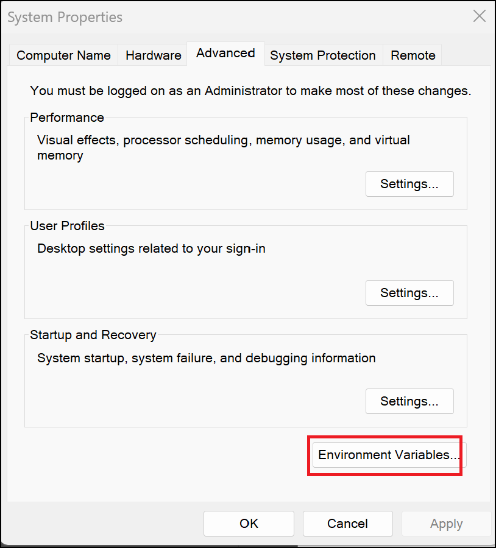

** Important :**We strongly recommend you configure the agent from an
elevated PowerShell window. If you want to configure as a service, this
is **required**.You must not use **Windows PowerShell ISE** to configure
the agent.

** Important :**For security reasons we strongly recommend making sure
the agents folder (C:\agents) is only editable by admins.

** Note :**Please avoid using mintty based shells, such as git-bash, for
agent configuration. Mintty is not fully compatible with native
Input/Output Windows API and we can't guarantee the setup script will
work correctly in this case.

### Task 4 : Configure and run the agent

1.  Start an elevated (PowerShell) window and set the location to where
    you unpacked the agent.

cd “C:\agents“

2.  Run config.cmd. This will ask you a series of questions to configure
    the agent. When setup asks for your server URL, for Azure DevOps
    Services, answer https://dev.azure.com/{your-organization}.

.\config.cmd

3.  The authentication method used for registering the agent is used
    only during agent registration. Press Enter accepting the
    Authentication method is PAT when prompts for -**Enter
    authentication type (press enter for PAT) and then enter your PAT
    and press Enter.**

> 

4.  Press Enter when prompts “**Enter agent pool (press enter for
    default)”**

5.  Type Agent name of your choice and press Enter

6.  Press Enter when prompt **“Enter work folder (press enter for
    \_work)”**

7.  Just Enter when prompt s Enter run agent as service? (Y/N) (press
    enter for N) and Enter configure autologon and run agent on startup?
    (Y/N) (press enter for N)

8.  Run the following the command to start the agent.

.\run.cmd

9.  Minimize the window and continue with next tasks.

Note : To restart the agent, press Ctrl+C to stop the agent, and then
run **run.cmd** to restart it.

### Task 5 : Create a fork Set up secrets for self-hosted agent

Create a fork so you can work with and modify the source files.
A *fork* is a copy of a GitHub repository. The copy exists in your
account and lets you make any changes you want without affecting the
original project.

Although you can propose changes to the original project, in this
lesson, you work with the *Space Game* web project In a web browser, go
to [GitHub](https://github.com/) and sign in with your GitHub account.

1.  Go to the Space Game web project -
    <https://github.com/MicrosoftDocs/mslearn-tailspin-spacegame-web.git>
    and  click on **Fork.**

2.  Enter the unique name of the repository and then click on **Create**
    button.

3.  Go to your forked GitHub repository and
    select **Settings** \> **Secrets and variables** \> **Codespaces
    -\>New repository secret.**

4.  Create the following Codespaces Repository secrets.

[TABLE]

5.  In your forked GitHub repository, select **Code.**

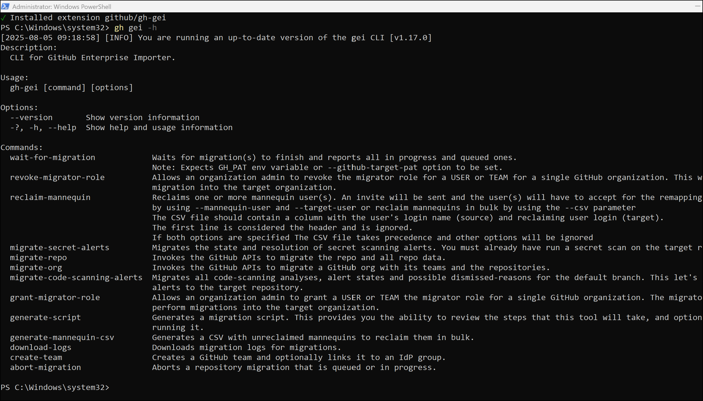

6.  Select **Code** again, choose the **Codespaces** tab, and
    choose **+** to create a new **Codespace**.

7.  Wait for your Codespace to build. This build can take a few moments,
    but you only have to do it once in this step of the training module.

8.  In the Visual Studio Code online editor, go to the terminal window
    and choose **bash** from the right-hand side.To list your remotes,
    run the git remote command:

git remote -v

9.  In the Visual Studio Code online editor, navigate to the terminal
    window, and to build the app, run this dotnet build command:

dotnet build --configuration Release

10. From the terminal window, to run the app, run this dotnet
    run command:

dotnet run --configuration Release --no-build --project
Tailspin.SpaceGame.Web

11. .NET solution files can contain more than one project.
    The --project argument specifies the project for the *Space
    Game* web app.

12. In development mode, the *Space Game* website is configured to run
    on port 5000.

13. You see a new message in the Visual Studio editor. Your application
    running on port 5000 is available. Select **Open in Browser** to go
    to the running app.

14. In the new browser window, you should see the Space Game web site:

15. You can interact with the page, including the leaderboard. When you
    select a player's name, you see details about that player:

16. When you're finished, return to the terminal window, and to stop the
    running app, select **Ctrl** + **C**.

## Exercise 2 - Set up your Azure DevOps environment

In this exercise, you'll ensure that your Microsoft Azure DevOps
organization is set up to complete the rest of this module.

### Task 1 : Get the Azure DevOps project

Here, you ensure that your Azure DevOps organization is set up to
complete the rest of this module. You do this by running a template that
creates a project for you in Azure DevOps.

1.  Open Visual Studio from Desktop and sign in with your accounts.

2.  Click on **Clone a repository**

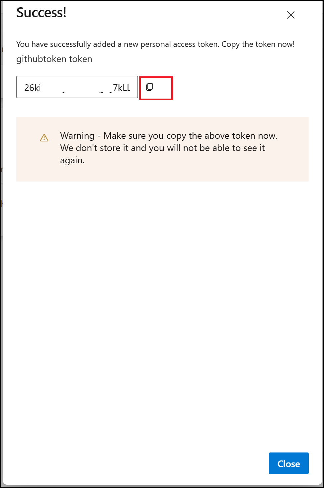

3.  Enter Repository location as
    <https://github.com/microsoft/AzDevOpsDemoGenerator.git> and select
    location and then click on **Clone**.

4.  **Set ADOGenerator as the Startup Project** In Visual Studio.
    Right-click on the ADOGenerator project in the Solution Explorer.
    Select **Set as Startup Project**.

> 

5.  **Build the Solution** Build the solution to ensure all dependencies
    are restored and the project compiles successfully.

6.  In Visual Studio, **right-click on the solution in the Solution
    Explorer** and select **Build Solution.**

> Note : Alternatively, you can use the command line: dotnet build

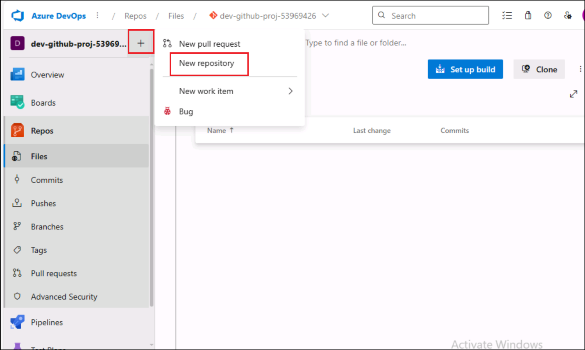

7.  Wait for the build to complete.

8.  Run the Project To run the project as a console application. In
    Visual Studio**, press F5** or click on the **Start** button.

Note : Alternatively, you can run the project from the command line:

> **dotnet run --project src/ADOGenerator/ADOGenerator.csproj**
>
> 

9.  Enter **1** (Create a new project….)when prompted for options

10. When prompted to **Enter the template number from the list of
    templates**, enter **22** for **Create a build pipeline with Azure
    Pipelines**, then press **Enter**.

> 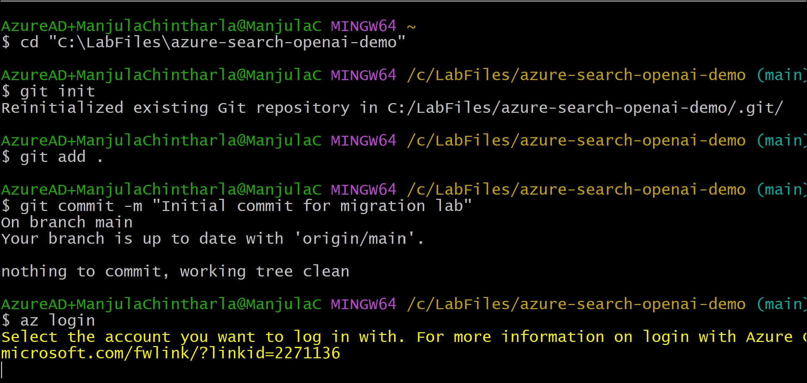

11. Choose your authentication method as Personal Access Token (PAT).
    Type 2 and press Enter.

> 

** Note:**If you set up a PAT, make sure to authorize the
necessary [**scopes**](https://learn.microsoft.com/en-us/azure/devops/integrate/get-started/authentication/oauth#scopes).
For this module, you can use **Full access**, but in a real-world
situation, you should ensure you grant only the necessary scopes.

12. Enter your Azure DevOps organization name (eg :**tffabrikanXX**),
    then press **Enter**.

> 

13. Enter your Azure DevOps PAT, then press **Enter**.

14. Enter a project name such as ***Space Game - web - Pipeline***, then
    press **Enter**.

15. Once your project is created, go to your Azure DevOps organization
    in your browser
    (at https://dev.azure.com/\<your-organization-name\>/) and select
    the project.

16. In Visual Studio, right-click on the **ADOGenerator** project in the
    Solution Explorer and select **Publish**.

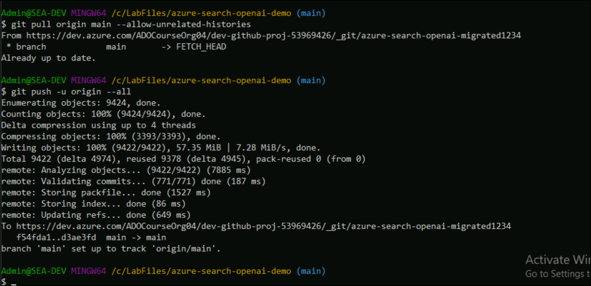

4\. Keep all default values , select region as **East US** and then
click on **Create**.

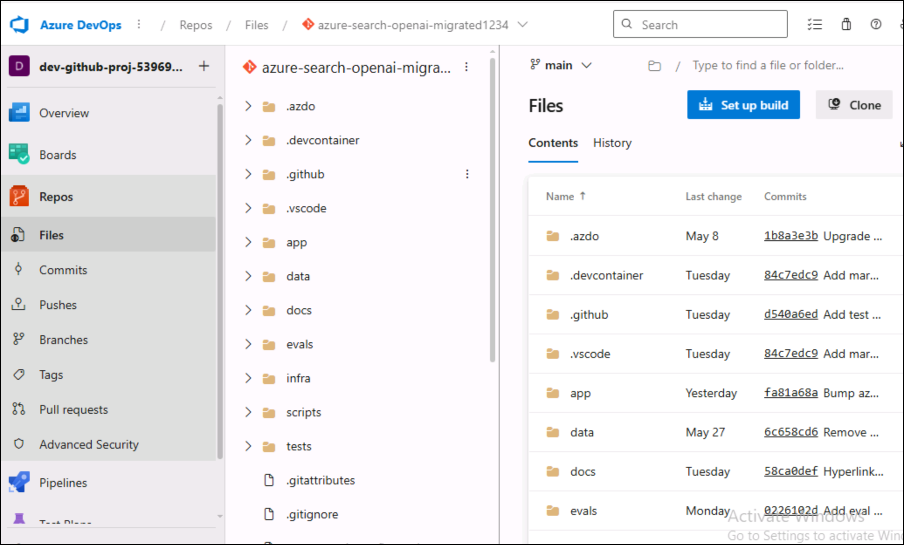

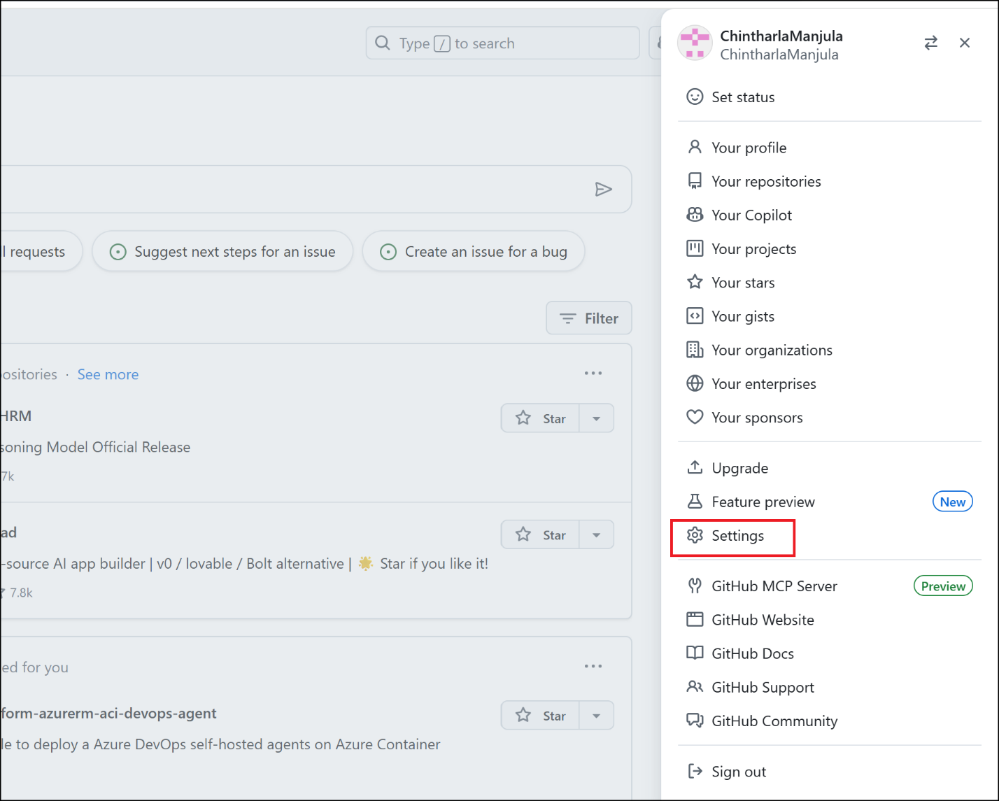

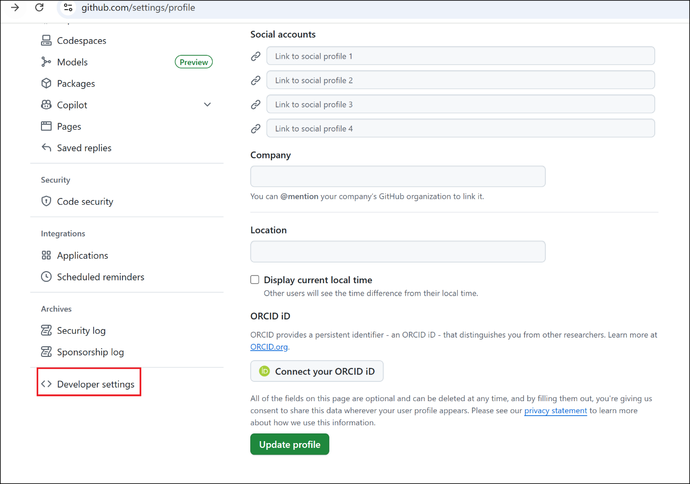

## Exercise 3- Create the pipeline

When you don't provide an initial YAML file for your project, Azure
Pipelines can create one for you based on your app type. Here, you'll
build an ASP.NET Core app, but Azure Pipelines also provides starter
build configurations for other project types, including Java, Go, and
more.

### Task 1 : Create the pipeline

1.  In Azure DevOps, go to your project. Select the project created
    above.

2.  Select **Pipelines** and then click on  **Create Pipeline**.

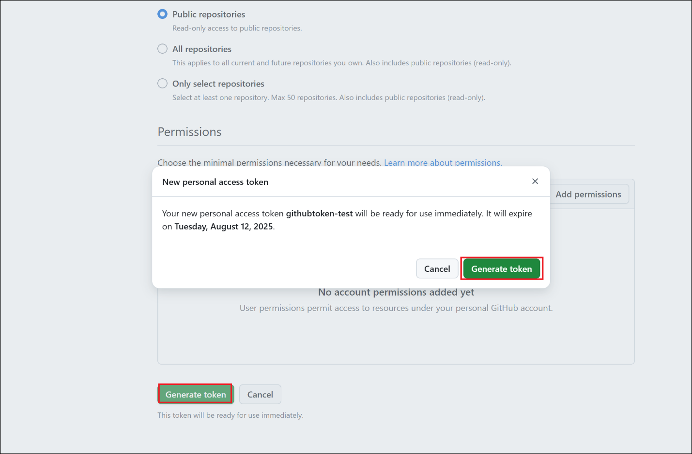

3.  On the **Connect** tab, select **GitHub**. When prompted, enter your
    GitHub credentials.

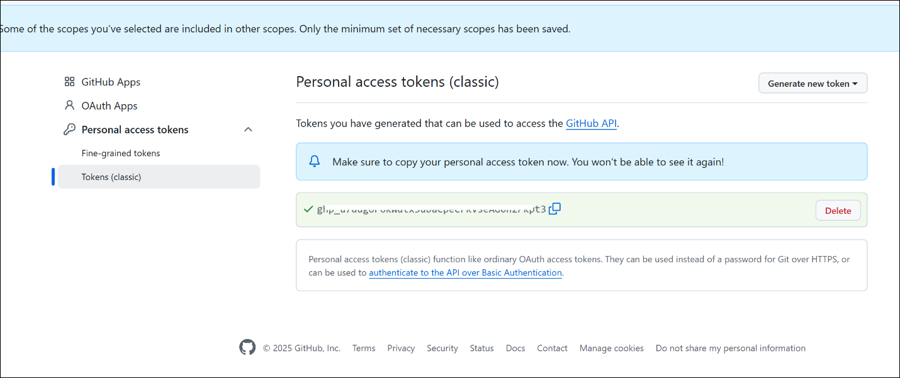

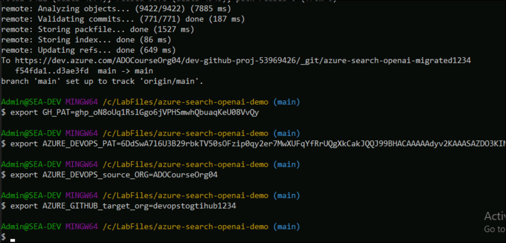

4.  On the **Select** tab, select
    your **mslearn-tailspin-spacegame-web** repository.

5.  To install the Azure Pipelines app, you might be redirected to
    GitHub. If so, scroll to the bottom, and select **Approve &
    Install**.

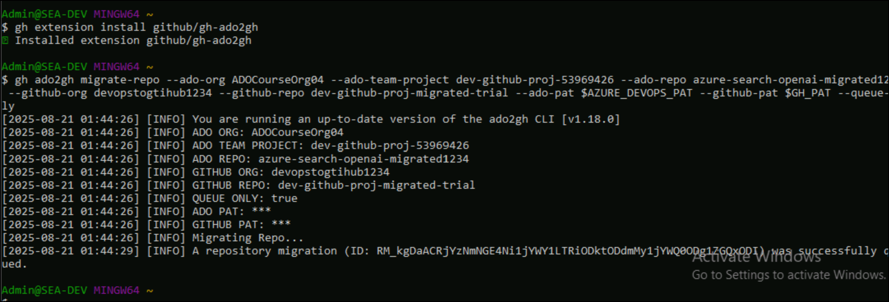

6.  On the **Configure** tab, select **ASP.NET Core**.

Note : IF you configure step skipped then rename azure-pipelines.yaml
file and then try to create pipeline

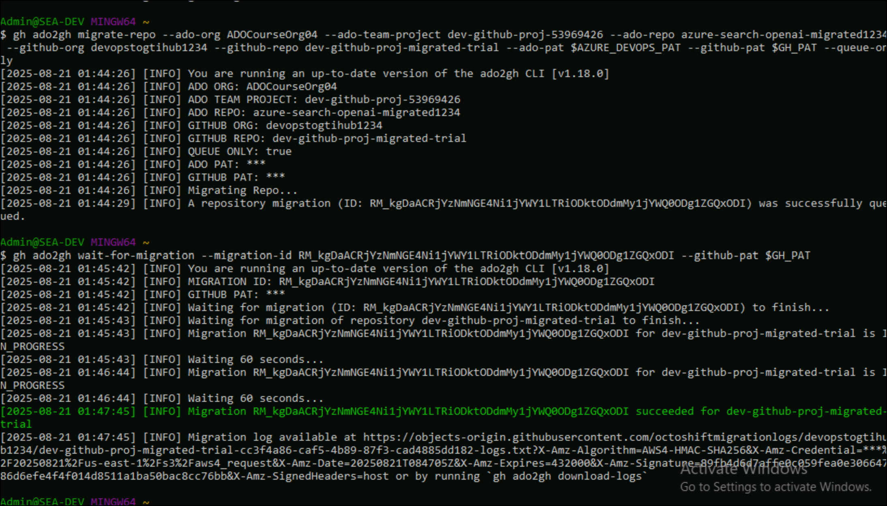

7.  On the **Review** tab, note the initial build configuration.

8.  This is a very basic configuration that Azure DevOps provides for
    you based on your app type, ASP.NET Core. The default configuration
    uses a Microsoft-hosted agent.

9.  On the **Review** tab, Add **name:Default** under Pool: section and
    select **Save and run**.

10. To commit your changes to GitHub and start the pipeline,
    choose **Commit directly to the main branch** and select **Save and
    run** a second time.

> 

11. If you're prompted to grant permission with a message like This
    pipeline needs permission to access a resource before this run can
    continue, choose **View** and follow the prompts to permit access.

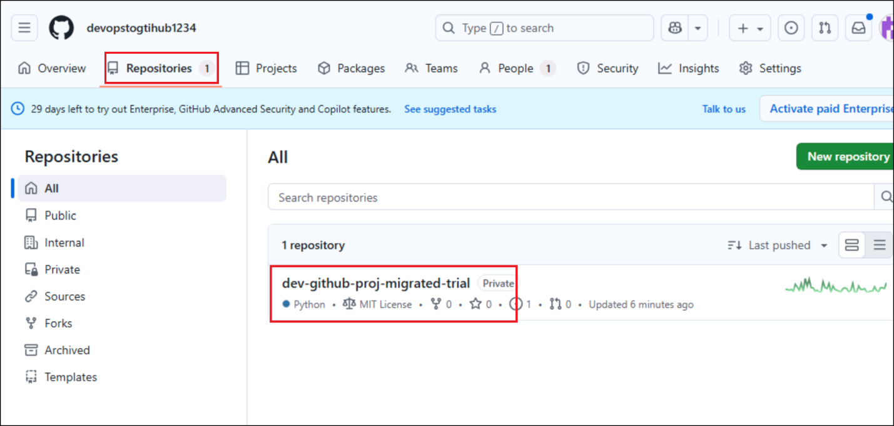

12. Under **Jobs**, select **Job**. Next, trace the build process
    through each of the steps. To see the job output as a text file when
    the build completes, you can also select **View raw log**.

13. If your pipeline doesn't start quickly, verify that Codespaces is
    still running. Codespaces will shut down after 30 minutes and may
    need to be restarted.

14. Here, you see the steps that the build definition created. It
    prepares the VM, fetches the latest source code from GitHub, and
    then builds the app.

15. This configuration is a great start, because now you have a place to
    add build tasks. You still need to update it to meet the needs of
    the Tailspin team, such as to minify JavaScript and CSS files.

** Tip:**Check your email. You might have already received a build
notification with the results of your run. You can use these
notifications to let your team members know when builds complete, and
whether each build passed or failed.

### Task 2 : Add build tasks

Now that you have a working build process, you can start to add build
tasks.

Remember that you're working from the main branch. To hold your work,
you'll now create a branch named build-pipeline. The branch gives you a
place to experiment and get your build working completely without
affecting the rest of the team.

You can add build tasks to *azure-pipelines.yml* directly from Azure
Pipelines. Azure Pipelines commits your changes directly to your branch.
Here, you'll change *azure-pipelines.yml* locally and *push*—or
upload—your changes to GitHub. Doing it this way lets you practice your
Git skills. Watch the pipeline automatically build the app when you push
up changes.

In practice, you might add build tasks one at a time, push your changes,
and watch the build run. Here, you'll add all the build tasks we
identified earlier at one time.

** Note:**You're about to run a few Git commands. Don't worry if you're
new to Git. We'll show you what to do. We'll also go into more detail
about Git in future modules.

1.  In Visual Studio Code, go to the integrated terminal. Ensure you go
    to the main branch in your repo and then go through the steps.

> git clone
> https://github.com/MicrosoftDocs/mslearn-tailspin-spacegame-web.git
>
> 
>
> 

2.  Open the cloned folder and open the terminal

3.  Update below commands with your username and email address and then
    run it.

git config --global user.name “YOUR GITHUB USERNAME”

git config --global user.email “YOUR GITHUB EMAIL”

4.  To fetch the latest changes from GitHub and update your main branch,
    run this git pull command.

git pull origin main

5.  You'll see from the output that Git fetches a file
    named *azure-pipelines.yml*. This is the starter pipeline
    configuration that Azure Pipelines created for you. When you set up
    the pipeline, Azure Pipelines adds this file to your GitHub
    repository.

6.  To create a branch named build-pipeline, run this git
    checkout command:

git checkout -B build-pipeline

7.  In Visual Studio Code, replace the  *azure-pipelines.yml* code with
    below code

> Note: take SS when run next time. Had publish code in this
>
> trigger:
>
> - '\*'
>
> pool:
>
>   name: 'Default'
>
> variables:
>
>   buildConfiguration: 'Release'
>
> steps:
>
> - task: UseDotNet@2
>
>   displayName: 'Use .NET SDK 8.x'
>
>   inputs:
>
>     packageType: sdk
>
>     version: '8.x'
>
> - task: Npm@1
>
>   displayName: 'Run npm install'
>
>   inputs:
>
>     command: 'install'
>
>     verbose: false
>
> - powershell: |
>
>     $scssPath = "Tailspin.SpaceGame.Web/wwwroot/scss"
>
>     if (Test-Path $scssPath) {
>
>       Write-Host "SCSS directory found. Compiling..."
>
>       npx sass Tailspin.SpaceGame.Web/wwwroot/scss:Tailspin.SpaceGame.Web/wwwroot/css
>
>     } else {
>
>       Write-Host "SCSS directory not found. Skipping Sass compilation."
>
>     }
>
>   displayName: 'Compile Sass assets'
>
> - script: 'npx gulp'
>
>   displayName: 'Run gulp tasks'
>
>   workingDirectory: Tailspin.SpaceGame.Web
>
> - script: |
>
>     echo "$(Build.DefinitionName), $(Build.BuildId), $(Build.BuildNumber)" \> buildinfo.txt
>
>   displayName: 'Write build info'
>
>   workingDirectory: Tailspin.SpaceGame.Web/wwwroot
>
> - script: 'npx gulp'
>
>   displayName: 'Run gulp tasks again'
>
>   workingDirectory: Tailspin.SpaceGame.Web
>
> - task: DotNetCoreCLI@2
>
>   displayName: 'Restore project dependencies'
>
>   inputs:
>
>     command: 'restore'
>
>     projects: '\*\*/\*.csproj'
>
> - task: DotNetCoreCLI@2
>
>   displayName: 'Build the project - Release'
>
>   inputs:
>
>     command: 'build'
>
>     arguments: '--no-restore --configuration Release'
>
>     projects: '\*\*/\*.csproj'
>
> 

8.  Under the steps section, you see the build tasks that map to each of
    the script commands that we identified earlier.

** Tip:**Before you run these Git commands, remember to
save *azure-pipelines.yml*.

git add azure-pipelines.yml

git commit -m "Add build tasks"

git push origin build-pipeline

9.  Click on “**Authorize git-ecosystem**”
    button.

10. Sign in with your GitHub credentials.

11. This time, you push the build-pipeline branch, not the main branch,
    to GitHub.Pushing the branch to GitHub triggers the build process in
    Azure Pipelines.

12. In Azure Pipelines, go to your build. To do so, on the side of the
    page, select **Pipelines**, then select your pipeline. You'll see
    your commit message and that the build is running using the code
    from the build-pipeline branch.

13. Click on Description of pipeline

14. Click on the job which is in running status.

15. Wait for the pipeline to run successfully.

16. Pipeline ran successfully.

** Tip:**If you don't see the build right away, wait a few moments or
refresh the page.

17. After your build completes, select any of the steps to see the
    overall progression of the build. From there, you can jump to the
    build logs or the associated change on GitHub.

## Exercise 4 - Publish the result to the pipeline

At this point, you can build the *Space Game* web project through the
pipeline.

But where do the build results go? Right now, the build output remains
on the temporary build server.

You can store build artifacts in Azure Pipelines so that they're
available to others on your team after the build completes, which is
what you'll do here. As a bonus, you'll also refactor the build
configuration to use variables to make the configuration easier to read
and keep up to date.

** Note:**Azure Pipelines lets you automatically deploy the built app to
a testing or production environment running in the cloud or in your
datacenter.

### Task 1 : Publish the build to the pipeline

In .NET, you can package your app as a .zip file. You can then use the
built-in PublishBuildArtifacts@1 task to publish the .zip file to Azure
Pipelines.

1.  In Visual Studio Code, replace the code
     ***azure-pipelines.yml*** with below code

> trigger:
>
> \- '\*'
>
> pool:
>
>   name: 'Default' \#test
>
> variables:
>
>   buildConfiguration: 'Release'
>
> steps:
>
> \- task: UseDotNet@2
>
>   displayName: 'Use .NET SDK 8.x'
>
>   inputs:
>
>     packageType: sdk
>
>     version: '8.x'
>
> \- task: Npm@1
>
>   displayName: 'Run npm install'
>
>   inputs:
>
>     command: 'install'
>
>     verbose: false
>
> \#  Sass compilation with Bash shell and directory check
>
> \- powershell: |
>
>     $scssPath = "Tailspin.SpaceGame.Web/wwwroot/scss"
>
>     if (Test-Path $scssPath) {
>
>       Write-Host " SCSS directory found. Compiling..."
>
>       npx sass
> Tailspin.SpaceGame.Web/wwwroot/scss:Tailspin.SpaceGame.Web/wwwroot/css
>
>     } else {
>
>       Write-Host " SCSS directory not found. Skipping Sass
> compilation."
>
>     }
>
>   displayName: 'Compile Sass assets'
>
> \- script: 'npx gulp'
>
>   displayName: 'Run gulp tasks'
>
>   workingDirectory: Tailspin.SpaceGame.Web
>
> \- script: |
>
>     echo "$(Build.DefinitionName), $(Build.BuildId),
> $(Build.BuildNumber)" \> buildinfo.txt
>
>   displayName: 'Write build info'
>
>   workingDirectory: Tailspin.SpaceGame.Web/wwwroot
>
> \- script: 'npx gulp'
>
>   displayName: 'Run gulp tasks'
>
>   workingDirectory: Tailspin.SpaceGame.Web
>
> \- task: DotNetCoreCLI@2
>
>   displayName: 'Restore project dependencies'
>
>   inputs:
>
>     command: 'restore'
>
>     projects: '\*\*/\*.csproj'
>
> \- task: DotNetCoreCLI@2
>
>   displayName: 'Build the project - Release'
>
>   inputs:
>
>     command: 'build'
>
>     arguments: '--no-restore --configuration Release'
>
>     projects: '\*\*/\*.csproj'
>
> \- task: DotNetCoreCLI@2
>
>   displayName: 'Publish the project - Release'
>
>   inputs:
>
>     command: 'publish'
>
>     projects: '\*\*/\*.csproj'
>
>     publishWebProjects: false
>
>     arguments: '--no-build --configuration Release --output
> $(Build.ArtifactStagingDirectory)/Release'
>
>     zipAfterPublish: true
>
> \- task: PublishBuildArtifacts@1
>
>   displayName: 'Publish Artifact: drop'
>
>   condition: succeeded()

The first task uses the DotNetCoreCLI@2 task to *publish* or package the
app's build results (including its dependencies) into a folder.
The zipAfterPublish argument specifies to add the built results to a
.zip file.

The second task uses the PublishBuildArtifacts@1 task to publish the
.zip file to Azure Pipelines. The condition argument specifies to run
the task only when the previous task succeeds. succeeded() is the
default condition, so you don't need to specify it, but we show it here
to show its use.

2.  From the integrated terminal, add *azure-pipelines.yml* to the
    index, commit the change, and push the change to GitHub.

** Tip:**Before you run these Git commands, remember to
save *azure-pipelines.yml*.

git add azure-pipelines.yml

git commit -m "Add publish tasks"

git push origin build-pipeline

3.  As you did earlier, from Azure Pipelines, trace the build through
    each of the steps.

4.  When the pipeline completes, go back to the build summary.

> 

5.  Under **Related**, there's **1 published**.

6.  Click on **published**.

7.  Expand the drop folder. You’ll see a ***.zip* file** that contains
    your built app and its dependencies:

## Exercise 5 - Clean up your Azure DevOps environment

You're all done with the tasks for this module. You'll now clean up your
Azure DevOps environment.

###  Task 1 : Disable the pipeline or delete your project

To create a clean environment for the duration of the module, each
module in this learning path provides a template that you can run.

Running multiple templates gives you multiple Azure Pipelines projects,
each pointing to the same GitHub repository. This can trigger multiple
pipelines to run each time you push a change to your GitHub repository,
which can cause you to run out of free build minutes on our hosted
agents. That's why it's important that you disable or delete your
pipeline before moving on to the next module.

1.  In Azure DevOps, go to your project. Earlier, we recommended that
    you name the **project *Space Game - web - Pipeline*.**

2.  Select **Project settings** in the bottom left corner.

3.  In the **Project details** area, scroll to the bottom, and
    select **Delete**.In the window that appears, enter the project
    name, and select **Delete** a second time.

### Task 2 : Delete codespace.

1.  Navigate back to your Github repository.

2.  Click on **Code-\> Codespace-**\> Select your codespce and click on
    **Delete**.

3.  Click on **Delete** to confirm deletion.

### Summary :

. You leant in creating an automated pipeline. You learned how to map
script commands on a build server to automated pipeline tasks that run
when you push code to GitHub. The result of the pipeline is
a *.zip* file that contains the built *Space Game* web app.

Along the way, you learned how to use variables to simplify your code.

You also learned how to use templates to encapsulate sets of tasks that
you can repeat throughout your build process. You used a template to
build the app's Debug and Release configurations.

Lastly, you practiced your Git skills by pushing commits to a branch and
building from that branch. Working from a branch lets you work in
isolation from the main code base. That helps you experiment and try new
things without affecting the main development branch, main.
