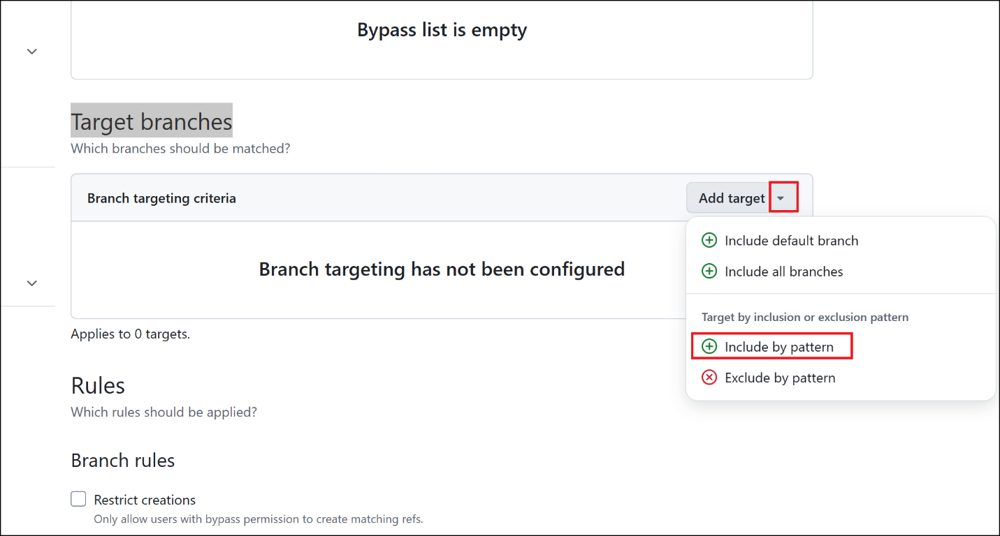
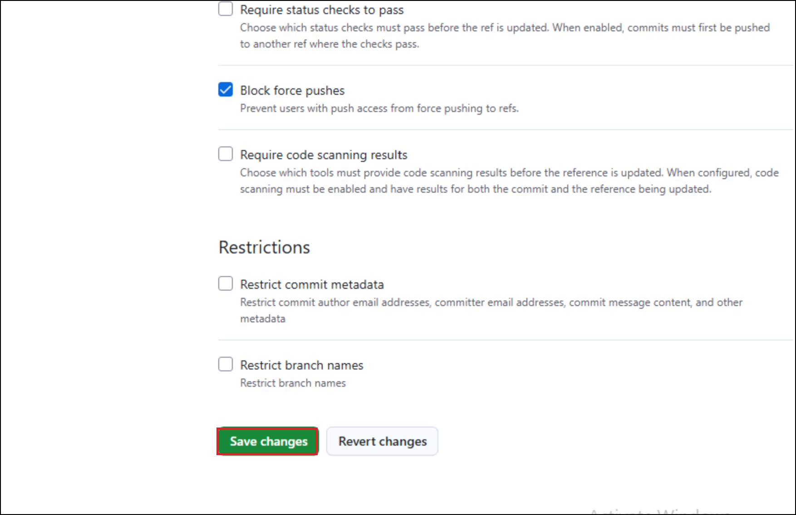

# Lab 2 - Post-Migration GitHub Repository Configuration Using CLI and Web UI

**Objective:**  
Continue from Lab 1 and configure the migrated repository in GitHub
Enterprise Cloud (GEC). Students will use GitHub CLI and GitHub Web UI
to set up metadata, permissions, security, and insights.

**Pre-requisites:**

- GitHub CLI (gh) installed

- Successful completion of Lab 1 with a migrated repository (e.g.,
  dev-github-proj-migrated-trial)

- Authenticated to GitHub (gh auth login)

- Admin access to the target repository

### Task 1: View Repository Settings in Browser

1.  Switch back to GitBash and replace \<YOUR_GEC_ORG\>/ with your GEC
    org name and then run it. This opens the repo in browser.

gh repo view \<YOUR_GEC_ORG\>/dev-github-proj-migrated-trial --web

2.  Click on **Settings** tab

3.  Navigate to **Settings** tab and explore:

- Visibility

- Topics

- Branch protection

- Security

### Task 2 : Edit Repository Metadata using CLI

1.  Now that our repo is migrated to GitHub, we'll add a meaningful
    description and categorize it with tags (topics) so that it’s easier
    to manage, discover, and understand the purpose of this repo.

2.  Switch back to GitBash and replace \<**YOUR_GEC_ORG\>** with your
    GEC org name and run.

gh repo edit \<YOUR_GEC_ORG\>/dev-github-proj-migrated-trial
--description "Migrated repo: Exploring GitHub settings" --add-topic
migration --add-topic github-enterprise --add-topic training

Note : Use relevant topics that reflect the project purpose (e.g.,
data-science, migrated-repo, azure, gei, etc.).

3.  Run this command in Git Bash to open the repository in your browser.
    This will open the repo's **homepage on GitHub**

gh repo view \<YOUR_GEC_ORG\>/dev-github-proj-migrated-trial --web

4.  You should see the updated description and topics

### Task 3 : Add Collaborators and Assign Roles

1.  Let us grant another GitHub user access to your repository. Replace
    ***\<YOUR_GEC_ORG\>*** with you’re your GEC org name and
    ***GITHUB_USERNAME*** with your team mate ***Github_username*** and
    run it.(You can also create one test GitHub account and use it )

2.  This sends a request to **invite** the user to collaborate on your
    repo. Assigns them the **Write** permission (they can push changes,
    but not manage repo settings)

gh api -X PUT -H "Accept: application/vnd.github+json"
repos/\<YOUR_GEC_ORG\>/dev-github-proj-migrated-trial/collaborators/GITHUB_USERNAME
-f permission=write

3.  Ask your team mate fi they got invitation and ask them to
    authenticate

> 

4.  Your team mate should have access to write permission to the repo

5.  Switch back to your GitHub account and the migrate repo . Click on
    **Settings -\>** **Collaborators and Teams** and you should see your
    team mate name under Manage access section with correct role.

### Task 4 : Configure Branch Protection (Web UI Only)

1.  Click on **Branches -\>** **Add branch ruleset**

2.  Enter **main** in **Ruleset Name** text box and select **Active**
    from **Enforcement status** drop down.

3.  Under Target branches , select **Add target -\> Include by
    pattern.**

4.  Enter **main** in **Branch naming pattern** and then click on **Add
    inclusion pattern**.( we used main for the lab purpose , you can use
    branch in your repos)

5.  Scroll down and under **Branch rules**, select the following:

- Require a pull request before merging- Automatically request Copilot
  code review

- Require linear history

6.  Scroll down and click **Create** or **Save changes**.

s

### Summary 

- Opened and explored your GitHub Enterprise Cloud (GEC) repository via
  GitHub CLI and Web UI

- Edited repository metadata including description and topics

- Granted access to teammates with the appropriate permissions via CLI

- Configured branch protection rules to enforce secure development
  practices

- Ensured the repository is ready for collaboration and compliant with
  common DevOps standards
