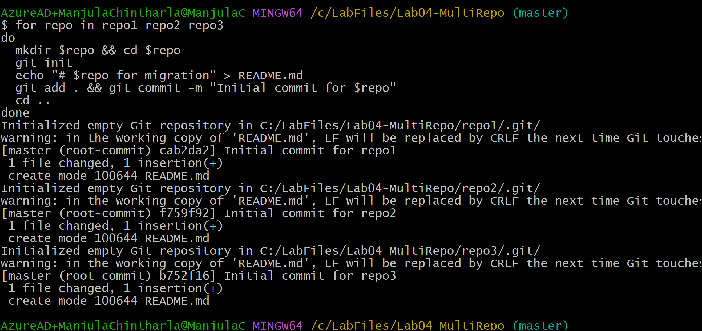
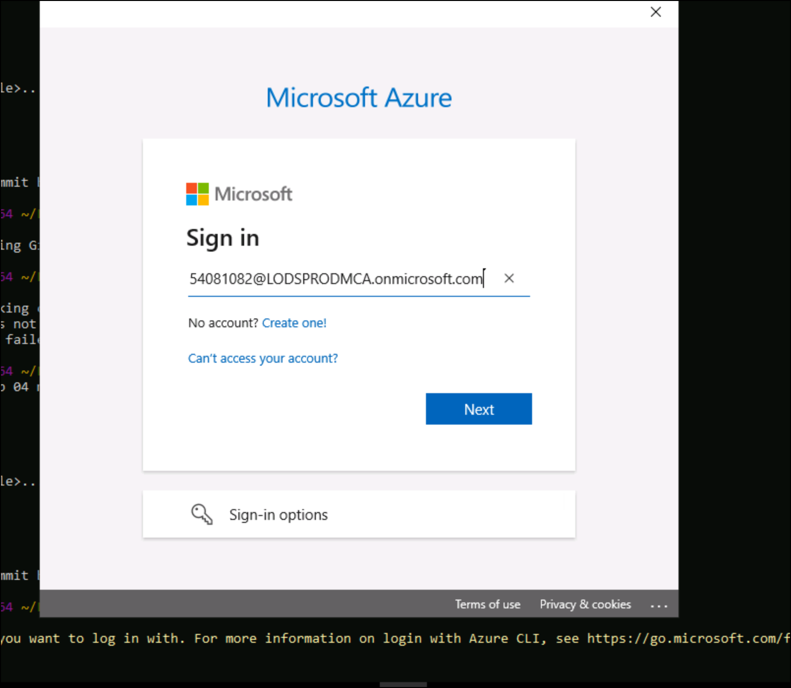
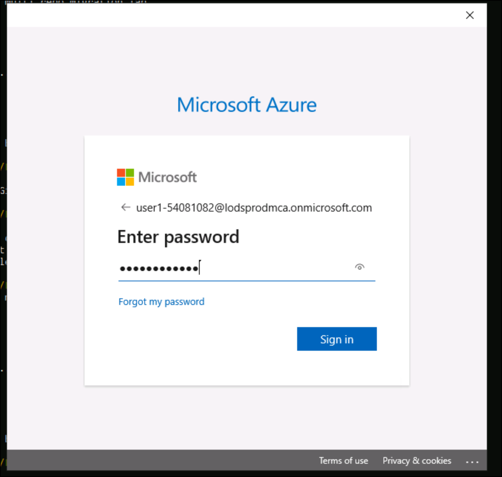
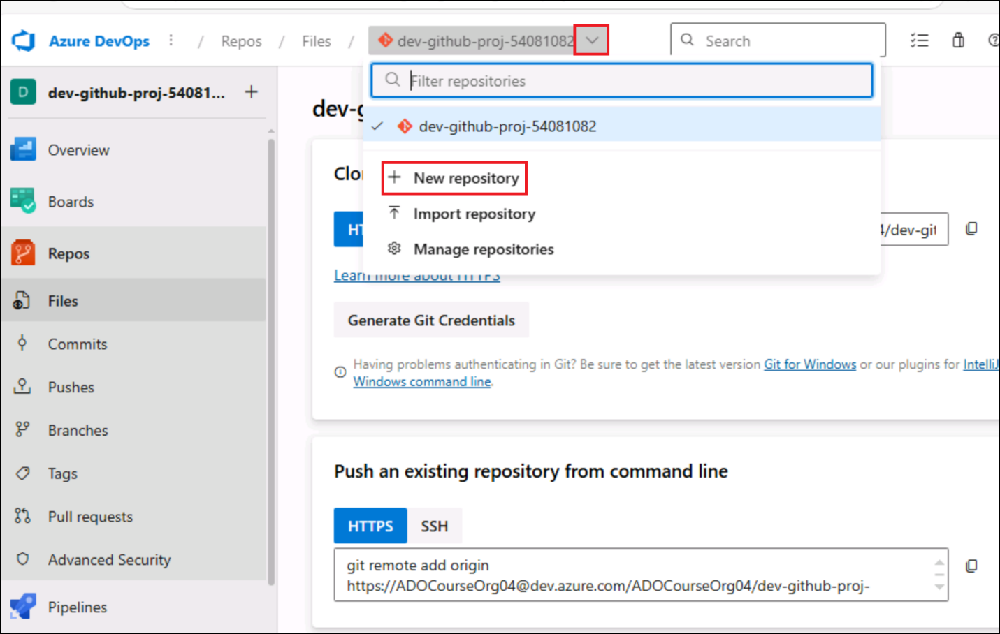
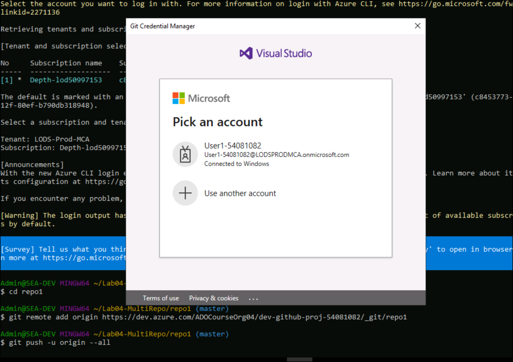
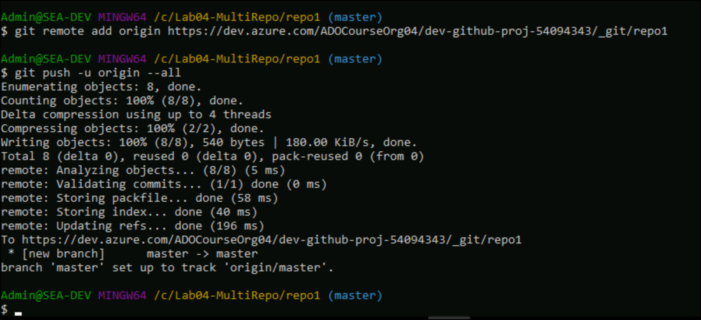
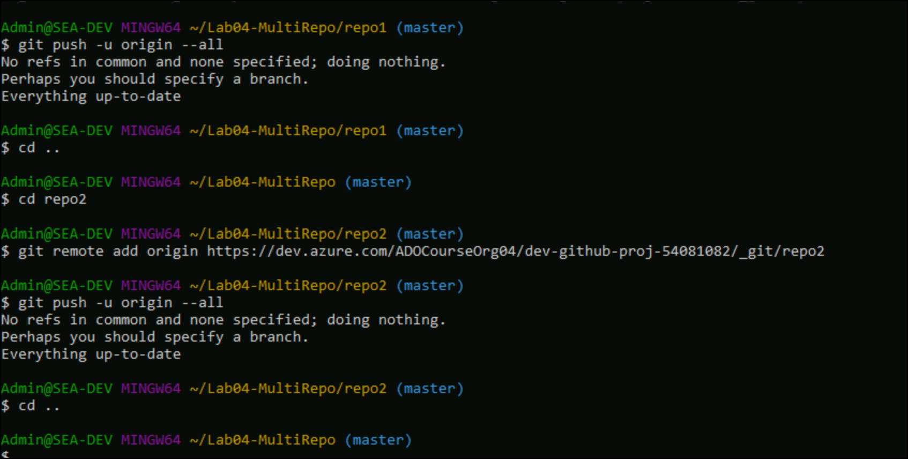
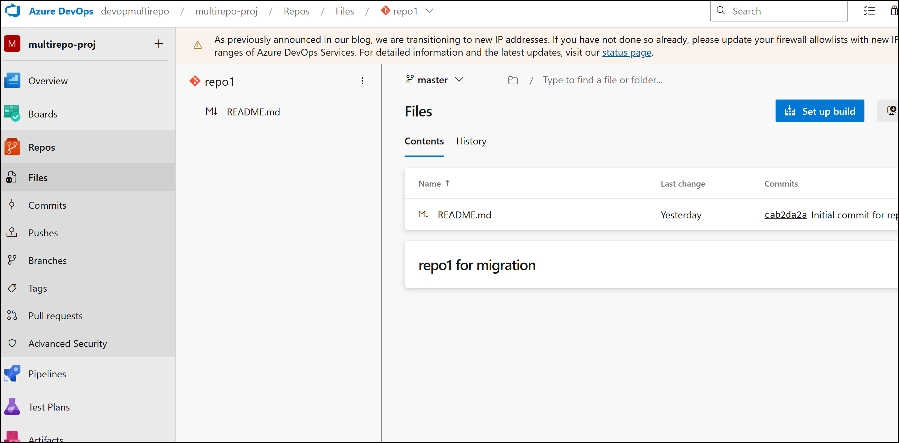
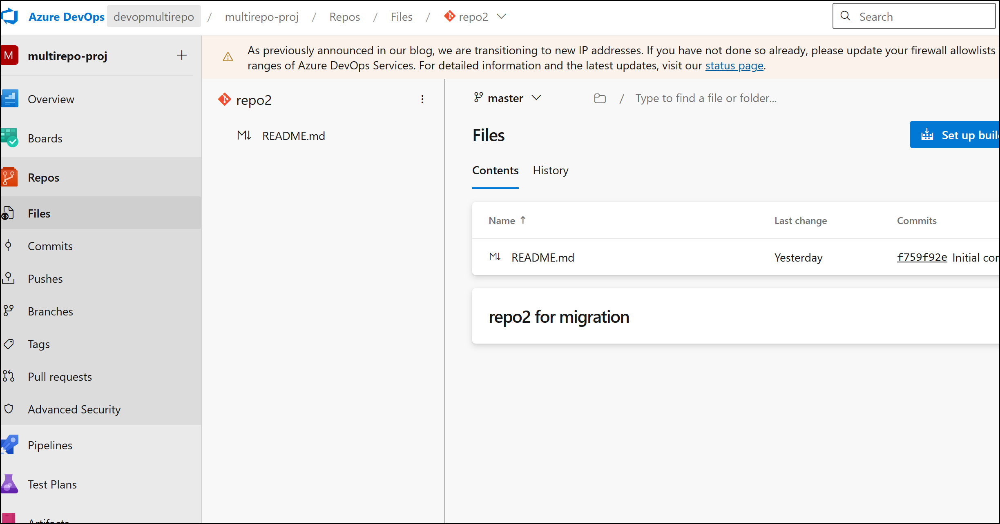

# Lab 04 - Simulate Dry Run Migration of Multiple Repositories from ADO to
GEC

**Objective**

Learn how to **simulate the dry-run migration** of **multiple Azure
DevOps (ADO) repositories** into **GitHub Enterprise Cloud (GEC)** using
a **batch-driven scripting approach**. This lab leverages **GitHub
CLI**, **GitHub Enterprise Importer (GEI)**, and custom shell scripts to
validate the readiness of large-scale repo migrations before executing
actual transfers.

### Task 1 : Create an Azure DevOps personal access token

1.  Create an Azure DevOps personal access token (PAT). Open a new tab
    in your browser and navigate to - +++https://portal.azure.com/+++ and
    sign in with assigned account.

2.  Search for **Azure DevOps** and select **Azure DevOps
    organizations**.

3.  Click on **My Azure DevOps Organization** hyper link.

4.  Click on **Create new organization** button.

5.  Click on **Continue**.

6.  Enter the organization name as : **devopmultirepo** enter the
    characters shown in your screen and then click on **Continue**.

7.  In the top right corner of the screen, click **User settings**.
    Click **Personal access tokens**.

8.  Select **+ New Token**

9.  Enter the name as : **mutlirepotoken** and select the Full scope and
    then click on **Create**.

10. Copy the generated API token and save it in a safe location. For
    your security, it won't be shown again.

11. Go back to organization home page, enter project name as :
    **multirepo-proj** and then click on Create. **multirepo-proj**

12. **Copy the URL form address bar and save it notepad for further
    use(eg https://dev.azure.com/devopmultirepo/multirepo-proj)**

13. **Click on** Repos- \> File **from left navigation menu.** Under
    section **Initialize main branch with a README or gitignore** ,
    select **Add a README** check box and **Python** from **Add a
    .gitignore ** drop down and then click on **Initialize.**

14. Copy the URL of the project and save it notepad.(eg -\>
    <https://dev.azure.com/devopmultirepo/_git/multirepo-proj> )

### Task 2 : : Create Local Repositories

1.  Switch back to GitBash and run below commands to create directory..

 +++mkdir Lab04-MultiRepo && cd Lab04-MultiRepo+++

 

2.  Run below script to create repositories
``for repo in repo1 repo2 repo3
do
  mkdir $repo && cd $repo
  git init
  echo "# $repo for migration" > README.md
  git add . && git commit -m "Initial commit for $repo"
  cd ..
done``

 

3.  **Open GitBash from Desktop and run below command to navigate to the
    project repo and commit changes**

+++git init+++

+++git add .+++

+++git commit -m "Lab 04 multi repo migration lab"+++

4.  **Switch back to GitBash and run below command to sign into Azure.
    Sign in with your Azure subscription account.**

+++az login+++

### Task 3 : Create Repos in Azure DevOps

1.  Go to your Azure DevOps ->     **devopmultirepo-\>multirepo-proj**
2. 

3.  Navigate to **Repos** → Click the repo dropdown → **New Repository**

3.  Create the following repositories (leave default settings): Do NOT
    add README/gitignore here, as your local repos already have those.

- +++repo1+++

- +++repo2+++

- +++repo3+++

### Task 4 : Push local repos to ADO repos

1.  Switch back to GitBash.Replace origin url with your repo urls and
    run the commands

+++cd repo1+++

+++git remote add origin https://dev.azure.com/devopmultirepo/multirepo-proj/_git/repo1+++

+++git push -u origin --all+++

+++cd ..+++

2.  Run below commands to push repo2

+++cd repo2+++
+++git remote add origin https://dev.azure.com/devopmultirepo/multirepo-proj/_git/repo2+++
+++git push -u origin --all+++
+++cd ..+++

3.  Run below commands to push repo3

+++cd repo3+++
+++git remote add origin https://dev.azure.com/devopmultirepo/multirepo-proj/_git/repo3+++
+++git push -u origin --all+++
+++cd ..+++

4.  Go back to Azure Devops project and check Repos-\> Files .You should
    see your repo here .

### Task 5: Simulate Dry-Run Migration of Multiple Repositories using Scripted Batch Mode

1.  Update below commands with your ADO’sPAT and GitHub’s PAT and run

+++export AZURE_DEVOPS_PAT=your_ado_pat_here+++

+++export GH_PAT=your_github_pat_here+++

2.  Run below command to create csv file and the below repo data and
    then save the file. This CSV acts as the migration map to control
    which ADO repos go to which GitHub repos.

+++vi repo-dryrun-map.csv+++

3.  Add below data to the file and save the file ( replace
    ado_org,ado_project,ado_repo,github_org,github_repo with your
    values) (Esc +wq and press enter)

``ado_org,ado_project,ado_repo,github_org,github_repo
https://dev.azure.com/devopmultirepo,multirepo-proj,repo1,devopstogtihub,repo1-migrated
https://dev.azure.com/devopmultirepo,multirepo-proj,repo2,devopstogtihub,repo2-migrated
https://dev.azure.com/devopmultirepo,multirepo-proj,repo3,devopstogtihub,repo3-migrated``

4.  Create another file with the name **dryrun-multi.sh** . Each
    migration will be queued in dry-run mode

+++vi dryrun-multi.sh+++

5.  Add the below code to it and save the file (Esc +wq and press enter)

``#!/bin/bash
echo " Starting Dry Run Migration for Multiple Repos"
# Skip header
tail -n +2 repo-dryrun-map.csv | while IFS=',' read -r ado_org ado_project ado_repo github_org github_repo
do
  # Skip empty lines
  if [[ -z "$ado_repo" || -z "$github_repo" ]]; then
    continue
  fi
  echo "Migrating $ado_repo ➜ $github_repo"
  gh ado2gh migrate-repo \
    --ado-org "$ado_org" \
    --ado-team-project "$ado_project" \
    --ado-repo "$ado_repo" \
    --github-org "$github_org" \
    --github-repo "$github_repo" \
    --ado-pat "$AZURE_DEVOPS_PAT" \
    --github-pat "$GH_PAT" \
    --queue-only
  echo "Dry Run Queued for $ado_repo"
  echo "--------------------------------------"
done
``

6.  Run below commands to allow script to run

+++chmod +x dryrun-multi.sh+++

+++./dryrun-multi.sh+++

### Summary : 

In this lab, you learnt:

1.  **Generate a Personal Access Token (PAT)** in Azure DevOps with full
    scope access for authentication.

2.  **Create and initialize local repositories** (repo1, repo2, repo3)
    to simulate real project repos.

3.  **Push these repositories to Azure DevOps**, creating matching
    remote repositories in your ADO project.

4.  **Build a mapping CSV file** to define the migration path from ADO
    repos to GitHub Enterprise Cloud target repos.

5.  **Write and execute a shell script** (dryrun-multi.sh) that reads
    from the CSV and runs **dry-run migrations** for each repo using the
    gh ado2gh migrate-repo command in batch mode with --queue-only flag.

6.  **Validate that each migration has been queued**, and optionally
    monitor results via gh ado2gh wait-for-migration and logs.

