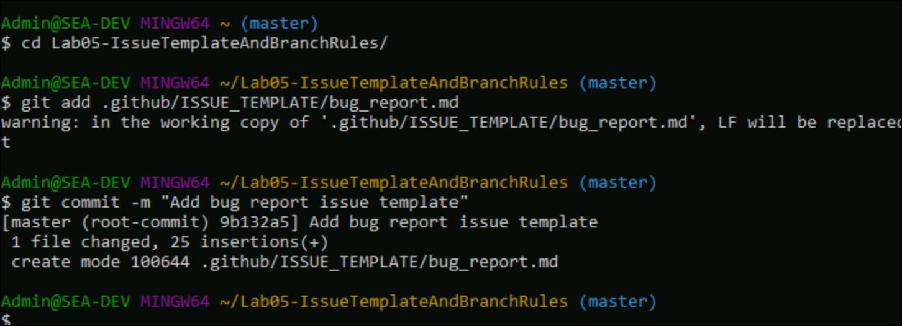

# Lab 5 - Create a GitHub Issue Template and Branch Protection Rules

**Objective**

Standardize issue reporting and enforce code quality across your
repositories by creating reusable issue templates and applying branch
protection rules.

## Task 1. Create Issue Template File

1.Swtich back to GitBash and run below commands to create the following
directory and file structure in your local repo

mkdir Lab05-IssueTemplateAndBranchRules

cd Lab05-IssueTemplateAndBranchRules

2\. Run below command to initialize the git

git init

3\. Run below command to create folder and file

mkdir -p .github/ISSUE_TEMPLATE

cd .github/ISSUE_TEMPLATE

vi bug_report.md

4\. Add the below template to the file . Press Esc, type :wq and hit
Enter to save and exit

---

name: Bug Report

about: Report a bug to help us improve

title: "\[BUG\] \<title\>"

labels: bug

assignees: ''

---

\*\*Describe the bug\*\*

A clear and concise description of what the bug is.

\*\*Steps to Reproduce\*\*

1\. Go to '...'

2\. Click on '....'

3\. See error

\*\*Expected behavior\*\*

What you expected to happen.

\*\*Screenshots\*\*

If applicable, add screenshots.

\*\*Additional context\*\*

Add any other context.

4\. Run below command to stage and Commit

cd ../../../

git add .github/ISSUE_TEMPLATE/bug_report.md

git commit -m "Add bug report issue template"

5\. Run below command to create Repo in GEC Org via GitHub CLI. Replace
\<GEC_ORG_NAME\> **with your GEC’s organization name**

gh repo create \<GEC_ORG_NAME\>/Lab05-IssueTemplateAndBranchRules
--public --confirm --clone

6\. Run below command to push local repo to the New GEC Repo. Make sure
to replace the remote URL if your org/repo name is different.

git remote add origin
https://github.com/\<GEC_ORG_NAME\>/Lab05-IssueTemplateAndBranchRules.git

git branch -M main

git push -u origin main

7\. Go back to your GitHub browser tab and navigate to GEC’s
organization and check repositories.

### Task 2: Create Branch Protection Rules

1.  Switch back to GitBash . Replace YOUR_ORG and YOUR_REPO with your
    actual values and run below command . You can add more protection
    fields like requiring status checks, restricting who can push, etc.

gh api
repos/\<GEC_ORG_NAME\>/Lab05-IssueTemplateAndBranchRules/branches/main/protection
\\

--method PUT \\

--input - \<\<EOF

{

"required_status_checks": {

"strict": true,

"contexts": \[\]

},

"enforce_admins": true,

"required_pull_request_reviews": {

"dismiss_stale_reviews": true,

"required_approving_review_count": 1

},

"restrictions": null

}

EOF

2.  The above script enforces PR review with at least 1
    approval,dismisses stale reviews on new commits,enforces rules even
    for admins,enables required status checks (none listed) and no push
    restrictions (open for all)

### Summary:

- You created a GitHub Issue Template to standardize bug reports.

- You enforced Branch Protection Rules using the GitHub CLI with the
  REST API.
