# Lab 06 -Azure Pipelines migrations powered by GitHub Actions Importer

These instructions will guide you through configuring the GitHub
Codespaces environment that you will use in this lab to learn how to use
GitHub Actions Importer to migrate Azure DevOps pipelines to GitHub
Actions.

## Exercise 1 - Create your own repository for these labs

- Ensure that you have created a repository
  using actions/importer-labs as a template.

### Task 1 : Configure your codespace

1.  Open a browser and navigate to the repo –
    <https://github.com/technofocus-pte/GHimporter.git> and sign in with
    your GitHub account.

2.  Click on **Use this template -\> Create a new repository**

> 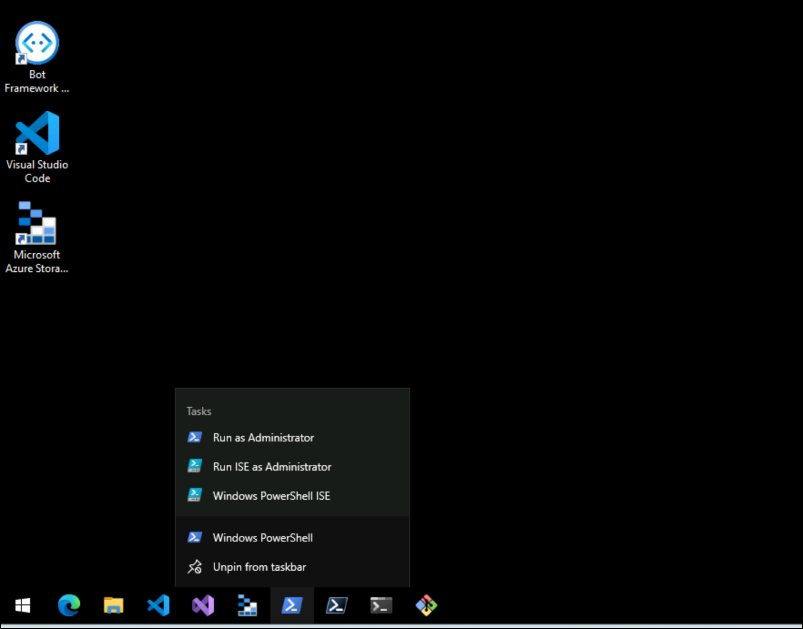

3.  Enter the unique Repository name and then click on **Create
    repository**.

> 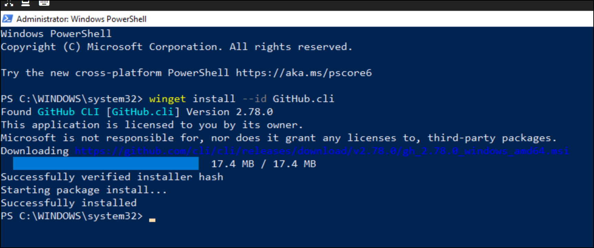

4.  Start a new codespace.

    - Click the Code button on your repository's landing page.

    - Click the Codespaces tab.

    - Click Create codespaces on main to create the codespace.

5.  After the codespace has initialized there will be a terminal present
    in new tab. It takes few min to get the environment ready.

6.  Run the following command in the codespace terminal to verify the
    GitHub Actions Importer CLI is installed and working.

*gh actions-importer version*

### Task 2 : Bootstrap your Azure DevOps organization

1.  Create an Azure DevOps personal access token (PAT). Open a new tab
    in your browser and navigate to - <https://portal.azure.com/> and
    sign in with assigned account.

2.  Search for **Azure DevOps** and select **Azure DevOps
    organizations**.

3.  Click on **My Azure DevOps Organization** hyper link.

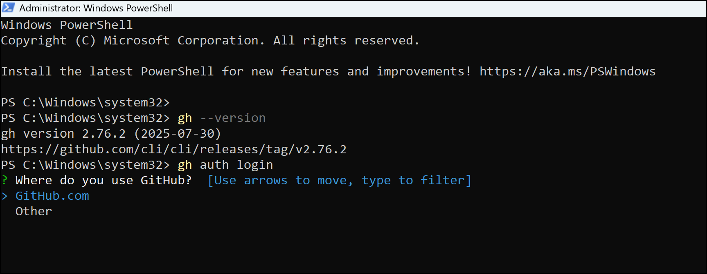

4.  Click on **Create new organization** button.

5.  Click on **Continue**.

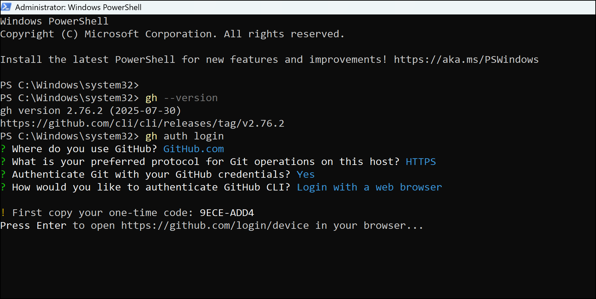

6.  Enter the organization name as : **mgrategithub** ,enter the
    characters shown in your screen and then click on **Continue**.

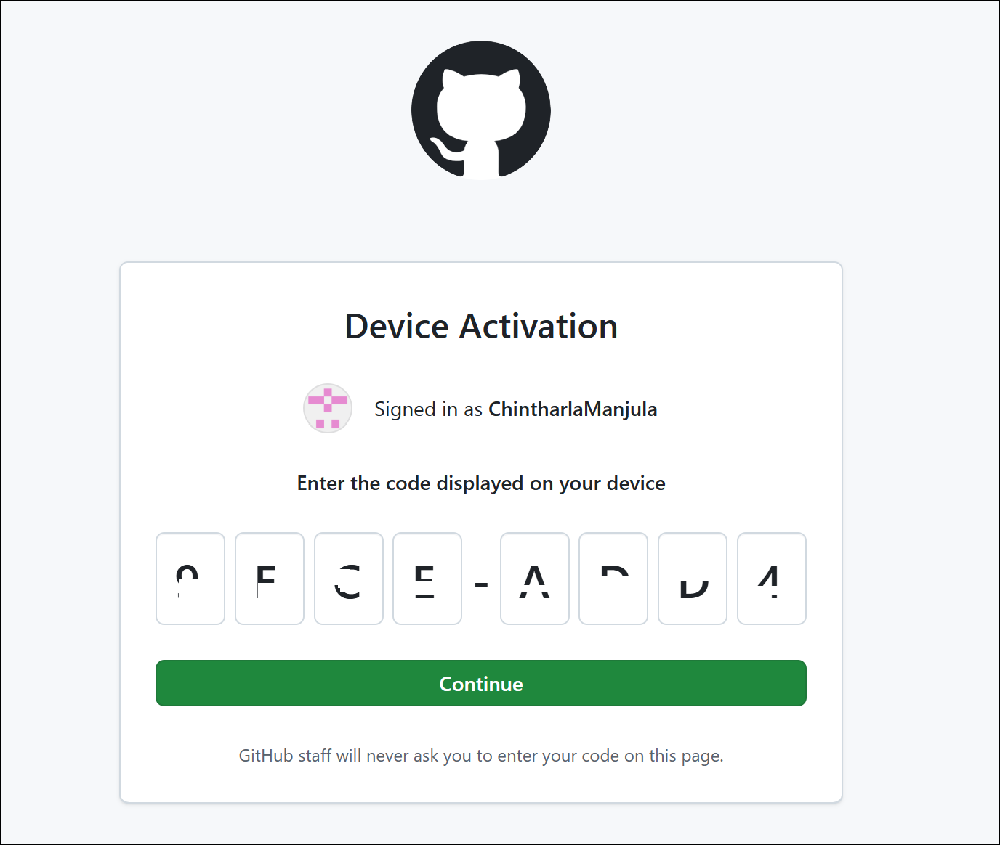

7.  In the top right corner of the screen, click **User settings**.
    Click Personal access tokens.

8.  Select **+ New Token**

9.  Enter the name as : **githubtoken** and select the following scopes
    (you may need to select Show all scopes at the bottom of the page to
    reveal all scopes):

    - Agents Pool: **Read & write**

    - Build: **Read & execute**

    - Code: **Read, write, & manage**

    - Deployment Groups : Read & manage

    - GitHub Connections: Read & manage

    - Pipeline Resources: Use and manage

    - Project and Team: **Read, write, & manage**

    - Pull Request Threads: Read & write

    - Release: **Read, write, execute, & manage**

    - Service Connections: **Read, query, & manage**

    - Team Dashboard: Read & manage

    - Task Groups: **Read, create, & manage**

    - **Test Management: Read & write**

    - Variable Groups: **Read, create, & manage**

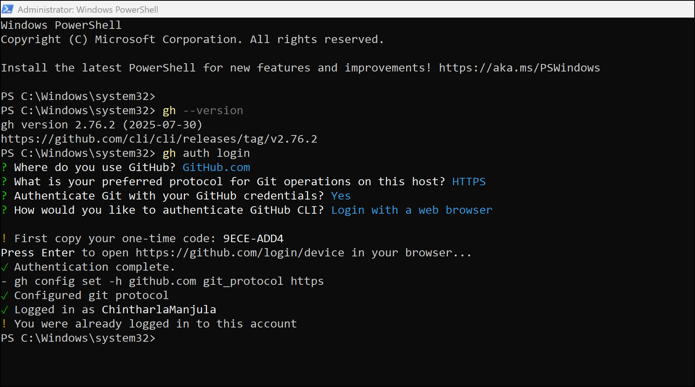

10. Copy the generated API token and save it in a safe location.

11. Switch back to Codepsace tab .Execute the Azure DevOps setup script
    that will create a new Azure DevOps project in your organization to
    be used in the following labs. **This script should only be run
    once.**

12. Run the following command from the codespace terminal, replacing the
    values accordingly:

    - :organization: the name of your existing Azure DevOps organization
      (eg- **migrategithub** )

    - :project: the name of the project to be created in your Azure
      DevOps organization (eg – **devgithubproj**\_

    - :access_token: the PAT created in step 1 above

./azure_devops/bootstrap/setup --organization **:organization**
--project **:project** --access-token **:access-token**

13. Switch back to your Azure DevOps project Organization tab and select
    your project.

14. Once authenticated, you will see an Azure DevOps project with a few
    predefined pipelines.

> 

## Exercise 2 : Configure credentials for GitHub Actions Importer

In this task, you will use the configure CLI command to set the required
credentials and information for GitHub Actions Importer to use when
working with Azure DevOps and GitHub.

### Task 1 :Create GitHub personal access token

1.  Switch back to GiitHub tab.In the top right corner of the UI, click
    your profile photo and then click **Settings**.

2.  In the left panel, click **Developer Settings**.

3.  Click **Personal access tokens** and then **Tokens (classic)** (if
    present).

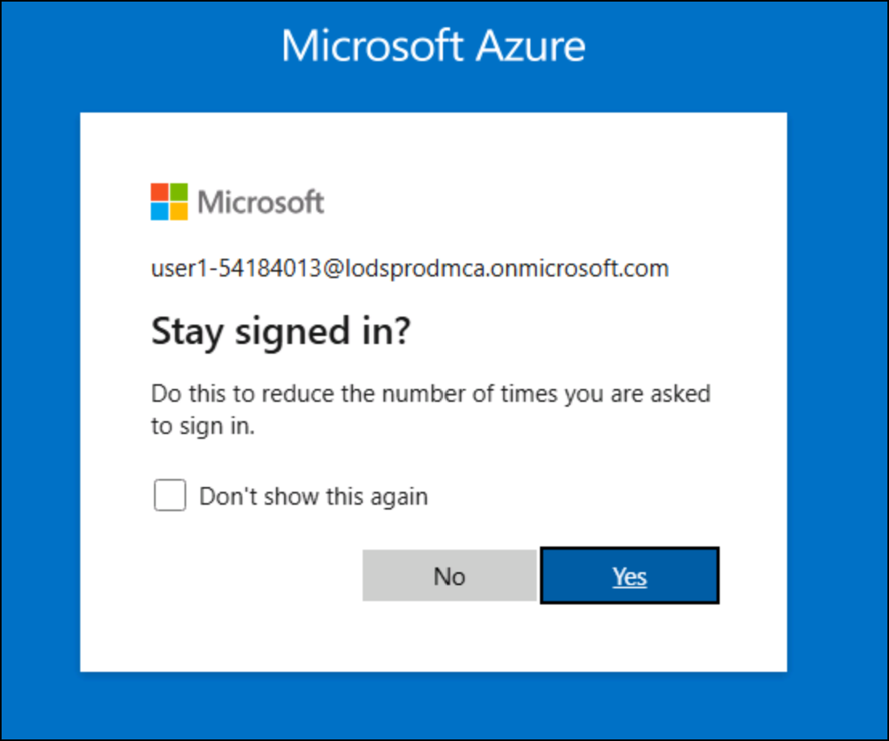

4.  Click **Generate new token** and then **Generate new token
    (classic).** You may be required to authenticate with GitHub during
    this step.

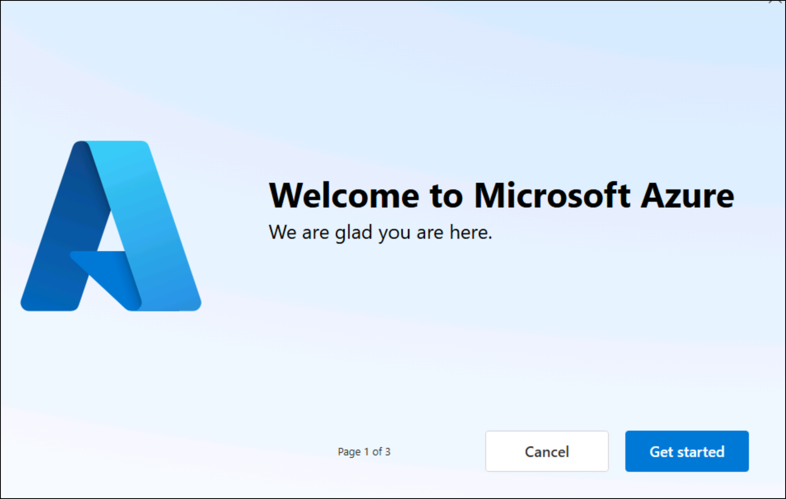

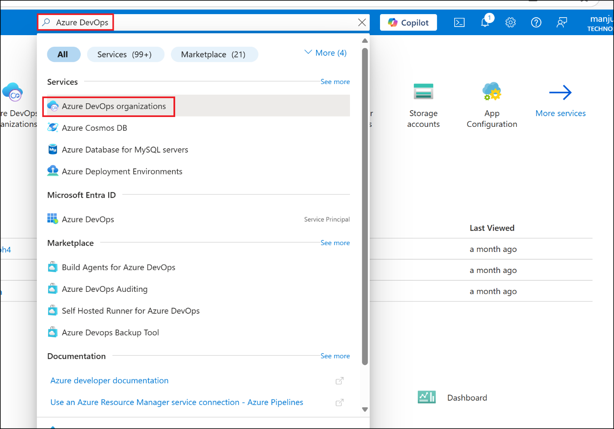

5.  Enter below values and the click on **Generate token**.

    - Name your token in the Note field.(eg – **DevopsGithub**)

    - **Select the following scope: workflow.**

    - Copy the generated PAT and save it in a safe location.

6.  Save the PAT to use in upcoming tasks.

7.  Switch back to Codespace and perform below actions

- run the following command

  - *gh actions-importer configure*.

- Use the down arrow key to highlight **Azure DevOps**, press the
  spacebar to select, and then press enter to continue.

> 

- At the GitHub PAT prompt, enter the **GitHub PAT** generated in step 2
  and press enter.

- At the GitHub URL prompt, enter the GitHub instance URL or press enter
  to accept the default value (https://github.com).

- At the Azure **DevOps token prompt**, enter the access token from step
  1 and press enter.

- At the Azure DevOps URL prompt, enter your Azure DevOps URL or press
  enter to accept the default value (https://dev.azure.com).

- At the prompt, enter your Azure DevOps organization name. (eg :
  **migrategithub** )

- At the prompt, enter your Azure DevOps project name. (eg :
  **devgithubproj**)

### Task 2 : Verify your environment

To verify your environment is configured correctly, run the update CLI
command. The update CLI command will download the latest version of
GitHub Actions Importer to your codespace.

1.  In the codespace terminal, run the following command:

*gh actions-importer update*

2.  You should see a confirmation that you were logged into the GitHub
    Container Registry and the image was updated to the latest version.

> 

## Exercise 3 : Perform an audit of an Azure DevOps project

In this task, you will use the audit command to get a high-level view of
all pipelines in an Azure DevOps organization or project.

### Task 1 : Perform Audit

The audit command will perform the following steps:

- Fetch all of the projects defined in an Azure DevOps organization.

- Convert each pipeline to their equivalent GitHub Actions workflow.

- Generate a report that summarizes how complete and complex of a
  migration is possible with GitHub Actions Importer.

- You will now perform an audit against the bootstrapped Azure DevOps
  project.

- What is the Azure DevOps organization name that you want to audit?

  1.  :organization. This should be the same organization you created in
      Azure DevOps

- What is the Azure DevOps project name that you want to audit?

  1.  :project. This should be the same project name created in your
      DevOps oragnization

- Where do you want to store the result?

  - tmp/audit. This can be any path within the working directory from
    which GitHub Actions Importer commands are executed.

1.  Switch back to o the codespace terminal and run the following
    command from the root directory:

gh actions-importer audit azure-devops --output-dir tmp/audit

Note: The Azure DevOps organization and project name can be omitted from
the audit command because they were persisted in the .env.local file in
the [configure
lab](https://github.com/actions/importer-labs/blob/main/azure_devops/1-configure.md).
You can optionally provide these arguments on the command line with
the --azure-devops-organization and --azure-devops-project CLI options.

2.  The command will list all the files written to disk in green when
    the command succeeds.

### Task 2 :Inspect the output files

1.  Find the **audit_summary.md** file in the file
    explorer-**tmp-\>audit-\> audit_summary.md** .

2.  Right-click the audit_summary.md file and select **Open Preview**.

3.  This file contains details that summarize what percentage of your
    pipelines were converted automatically.

 4. Here are some key terms in the
"Pipelines" section:

- Successful pipelines had 100% of the pipeline constructs and
  individual items converted automatically to their GitHub Actions
  equivalent.

- Partially successful pipelines had all of the pipeline constructs
  converted, however, there were some individual items (e.g. build tasks
  or build triggers) that were not converted automatically to their
  GitHub Actions equivalent.

- Unsupported pipelines are definition types that are not supported by
  GitHub Actions Importer. The following Azure DevOps pipeline types are
  supported:

  - Classic (designer)

  - YAML

  - Release

- Failed pipelines encountered a fatal error when being converted. This
  can occur for one of three reasons:

  - The pipeline was misconfigured and not valid in Azure DevOps.

  - GitHub Actions Importer encountered an internal error when
    converting it.

  - There was an unsuccessful network response, often due to invalid
    credentials, that caused the pipeline to be inaccessible.

The "Job types" section will summarize which types of pipelines are
being used and which are supported or unsupported by GitHub Actions
Importer.

4.  The build steps summary section presents an overview of the
    individual build steps that are used across all pipelines and how
    many were automatically converted by GitHub Actions Importer.

> 

5.  Here are some key terms in the "Build steps" section:

- A known build step is a step that was automatically converted to an
  equivalent action.

- An unknown build step is a step that was not automatically converted
  to an equivalent action.

- An unsupported build step is a step that is either:

  - A step that is fundamentally not supported by GitHub Actions.

  - A step that is configured in a way that is incompatible with GitHub
    Actions.

- An action is a list of the actions that were used in the converted
  workflows. This is important for the following scenarios:

  - Gathering the list of actions to sync to your appliance if you use
    GitHub Enterprise Server.

  - Defining an organization-level allowlist of actions that can be
    used. This list of actions is a comprehensive list of which actions
    their security and/or compliance teams will need to review.

There is an equivalent breakdown of build triggers, environment
variables, and other uncategorized items displayed in the audit summary
file.

6.  Manual Tasks-The manual tasks summary section presents an overview
    of the manual tasks that you will need to perform that GitHub
    Actions Importer is not able to complete automatically.

Here are some key terms in the "Manual tasks" section:

- A secret refers to a repository or organization level secret that is
  used by the converted pipelines. These secrets will need to be created
  manually in Actions in order for these pipelines to function properly.

- A self-hosted runner refers to a label of a runner that is referenced
  by a converted pipeline that is not a GitHub-hosted runner. You will
  need to manually define these runners in order for these pipelines to
  function properly.

7.  The final section of the audit report provides a manifest of all of
    the files that are written to disk during the audit. These files
    include:

Each pipeline will have a variety of files written that include:

- The original pipeline as it was defined in Azure DevOps.

- Any network responses used to convert a pipeline.

- The converted workflow.

- Stack traces that can used to troubleshoot a failed pipeline
  conversion

- Inspect the workflow usage .csv file

1.  Open the **tmp/audit/workflow_usage.csv** file in the file
    explorer.This file contains a comma-separated list of all actions,
    secrets, and runners that are used by each successfully converted
    pipeline:

The contents of this file can be useful in answering questions similar
to the following:

- What workflows will depend on which actions?

- What workflows use an action that must go through a security review?

- What workflows use specific secrets?

- What workflows use specific runners?

## Exercise 4 : Forecast potential build runner usage

In this exercise you will use the forecast command to forecast potential
GitHub Actions usage by computing metrics from completed pipeline runs
in your Azure DevOps project.

### Task 1 : Perform a forecast

Answer the following questions before running the forecast command:

1.  What is the Azure DevOps organization name that you want to audit?

    - **:organization**. This should be the same organization you
      created(eg **migrategithub** )

2.  What is the Azure DevOps project name that you want to audit?

    - **:project**. This should be the same project your created in
      previous task (eg – **devgithubproj**)

3.  Where do you want to store the results?

    - **tmp/forecast**

**Steps**

1.  Swich back to the codespace terminal.Run the following command from
    the root directory:

gh actions-importer forecast azure-devops --output-dir tmp/forecast

**Note**: The Azure DevOps organization and project name can be omitted
from the forecast command because they were persisted in
the .env.local file in the [configure
lab](https://github.com/actions/importer-labs/blob/main/azure_devops/1-configure.md).
You can optionally provide these arguments on the command line with
the --azure-devops-organization and --azure-devops-project CLI options.

2.  The command will output a message that says "No jobs found" because
    no jobs have been executed in your bootstrapped project.

> 

3.  Run the following forecast command while specifying the path to the
    sample json files:

> *gh actions-importer forecast azure-devops --output-dir tmp/forecast
> --source-file-path azure_devops/bootstrap/jobs.json*
>
> 

### Task 2 : Review the forecast report

The forecast report, logs, and completed job data will be located within
the tmp/forecast folder.

1.  Find the **forecast_report.md** file in the file explorer
    **tmp-\>forecasr-forecast_report.md**

2.  Right-click the forecast_report.md file and select **Open Preview**.

3.  This file contains metrics used to forecast potential GitHub Actions
    usage.

Here are some key terms of items defined in the forecast report:

- The Job count is the total number of completed jobs.

- The Pipeline count is the number of unique pipelines used.

- Execution time describes the amount of time a runner spent on a job.
  This metric can be used to help plan for the cost of GitHub hosted
  runners.

  - This metric is correlated to how much you should expect to spend in
    GitHub Actions. This will vary depending on the hardware used for
    these minutes. You can use the Actions pricing calculator to
    estimate a dollar amount.

- Queue time metrics describe the amount of time a job spent waiting for
  a runner to be available to execute it.

- Concurrent jobs metrics describe the amount of jobs running at any
  given time. This metric can be used to define the number of runners a
  customer should configure.

Additionally, these metrics are defined for each queue of runners
defined in Azure DevOps. This is especially useful if there are a mix of
hosted/self-hosted runners or high/low spec machines to see metrics
specific to different types of runners.

## Exercise 5 : Perform a dry-run migration of an Azure DevOps pipeline

In this exercise you will use the dry-run command to convert an Azure
DevOps pipeline to its equivalent GitHub Actions workflow.

### Task 1 : Perform a dry run

You will perform a dry run for a pipeline in the bootstrapped Azure
DevOps project. Answer the following questions before running this
command:

1.  Preform below actions to get id of the pipeline to convert

    - **:pipeline_id**. This id can be found by:

      - Navigating to the build pipelines in the bootstrapped Azure
        DevOps
        project <https://dev.azure.com/:organization/:project/_build>

      - Selecting the pipeline with the name "**pipeline1**"

- Inspecting the URL to locate the pipeline
  id <https://dev.azure.com/:organization/:project/_build?definitionId=:pipeline_id>

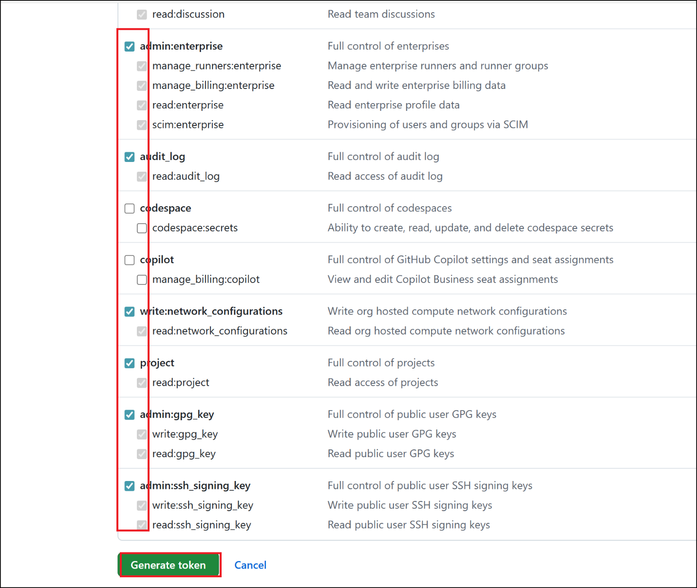

2.  You store the results in **tmp/dry-run**. This can be any path
    within the working directory from which GitHub Actions Importer
    commands are executed.

3.  Switch back to your codespace terminal.Replace **:pipeline_id** with
    your pipeline id .Run the following command from the root directory:

*gh actions-importer dry-run azure-devops pipeline --pipeline-id
:pipeline_id --output-dir tmp/dry-run*

4.  The command will list all the files written to disk when the command
    succeeds.Click **pipeline1.yml** to open.

> 
>
> 

### Task 2 : Inspect the output files

The files generated from the dry-run command represent the equivalent
Actions workflow for the given Azure DevOps pipeline. The Azure DevOps
pipeline and converted workflow can be seen below:

Despite these two pipelines using different syntax they will function
equivalently.

## Exercise 6 : Using custom transformers to customize GitHub Actions Importer's behavior

In this exercise we will build upon the dry-run command to override
GitHub Actions Importer's default behavior and customize the converted
workflow using "custom transformers". Custom transformers can be used
to:

1.  Convert items that are not automatically converted.

2.  Convert items that were automatically converted using different
    actions.

3.  Convert environment variable values differently.

4.  Convert references to runners to use a different runner name in
    Actions.

### Task 1 : Perform a dry run

You will perform a dry-run for a pipeline in the bootstrapped Azure
DevOps project. Answer the following questions before running this
command:

1.  Switch back to Azure Devops tab to get id of the pipeline to convert

    - **:pipeline_id**. This id can be found by:

      - Navigating to the build pipelines in the bootstrapped Azure
        DevOps
        project <https://dev.azure.com/:organization/:project/_build>

      - Selecting the pipeline with the name
        "**custom-transformer-example**"

      - Inspecting the URL to locate the pipeline
        id <https://dev.azure.com/:organization/:project/_build?definitionId=:pipeline_id>

2.  Where do you want to store the result?

    - **tmp/dry-run**. This can be any path within the working directory
      from which GitHub Actions Importer commands are executed.

3.  Navigate to the codespace terminal.Repalce :pipeline-id with your
    piline id the command and run from the root directory:

*gh actions-importer dry-run azure-devops pipeline --pipeline-id
:pipeline_id --output-dir tmp/dry-run*

4.  The command will list all the files written to disk when the command
    succeeds.

### Task 2 : Converted workflow 

You can use custom transformers to override GitHub Actions Importer's
default behavior. In this scenario, you may want to override the
behavior for converting DotnetCoreCLI@2 tasks to support parameters that
are glob patterns.

1.  What is the "identifier" of the step to customize?

    - **DotnetCoreCLI@2**

2.  What is the desired Actions syntax to use instead?

    - After some research, you have determined that the following script
      will provide the desired functionality:

> \- run: shopt -s globstar; for f in ./\*\*/\*.csproj; do dotnet build
> $f --configuration ${{ env.BUILDCONFIGURATION }} ;

3.  Now you can begin to write the custom transformer. Custom
    transformers use a DSL built on top of Ruby and should be defined in
    a file with the .rb file extension. You can create this file by
    running the following command in your codespace terminal:

*touch transformers.rb && code transformers.rb*

4.  To build this custom transformer, you first need to inspect
    the item keyword to programmatically obtain the projects, command,
    and arguments to use in the DotNetCoreCLI@2 step.

5.  To do this, you will print item to the console. You can achieve this
    by adding the following custom transformer to transformers.rb:

*transform "DotNetCoreCLI@2" do |item|*

*puts "This is the item: \#{item}"*

*end*

6.  The transform method can use any valid ruby syntax and should return
    a Hash that represents the YAML that should be generated for a given
    step. GitHub Actions Importer will use this method to convert a step
    with the provided identifier and will use the item parameter for the
    original values configured in Azure DevOps.

Now, you can perform a dry-run command with
the --custom-transformers CLI option. The output of the dry-run command
should look similar to this:

*$ gh actions-importer dry-run azure-devops pipeline --pipeline-id 6
--output-dir tmp/dry-run --custom-transformers transformers.rb*

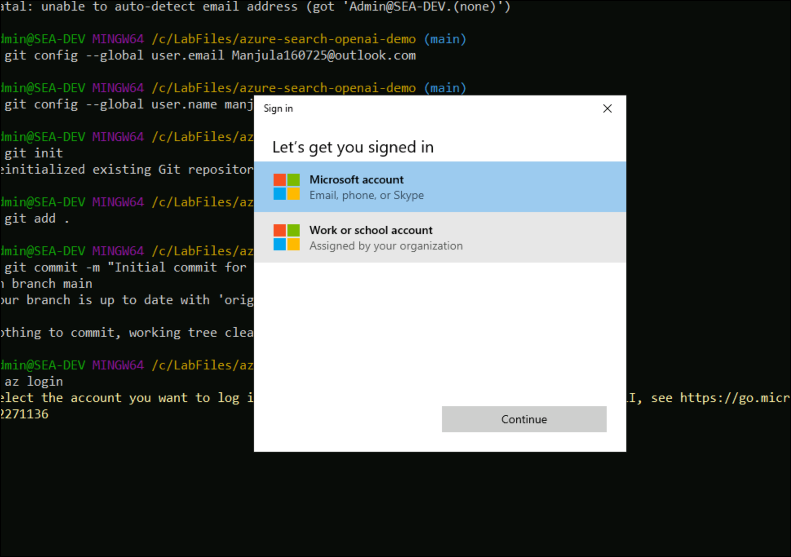

7.  In the above command you will see two instances of item printed to
    the console. This is because there are two DotNetCoreCLI@2 steps in
    the pipeline. Each item listed above represents
    each DotNetCoreCLI@2 step in the order that they are defined in the
    pipeline.

Now that you know the data structure of item, you can access the dotnet
projects, command, and arguments programmatically by editing the custom
transformer to the following:

transform "DotNetCoreCLI@2" do |item|

projects = item\["projects"\]

command = item\["command"\]

run_command = \[\]

if projects.include?("$")

command = "build" if command.nil?

run_command \<\< "shopt -s globstar; for f in ./\*\*/\*.csproj; do
dotnet \#{command} $f \#{item\['arguments'\]} ; done"

else

run_command \<\< "dotnet \#{command} \#{item\['projects'\]}
\#{item\['arguments'\]}"

end

{

run: run_command.join("\n"),

shell: "bash",

}

End

8.  Now you can perform another dry-run command and use
    the --custom-transformers CLI option to provide this custom
    transformer. Run the following command within your codespace
    terminal:

gh actions-importer dry-run azure-devops pipeline --pipeline-id
:pipeline_id --output-dir tmp/dry-run --custom-transformers
transformers.rb

9\. Open the workflow that is generated and inspect the contents.
The DotnetCoreCLI@2 steps are now converted using the customized
behavior.

### Task 3 : Custom transformers for environment variables

1.  You can also use custom transformers to edit the values of
    environment variables in converted workflows. In this example, you
    will be updating the BUILDCONFIGURATION environment variable to
    be Debug instead of Release.

2.  add the following code at the top of the transformers.rb file.

env "BUILDCONFIGURATION", "Debug"

3.  In this example, the first parameter to the env method is the
    environment variable name and the second is the updated value.

4.  Now you can perform another dry-run command with
    the --custom-transformers CLI option. When you open the converted
    workflow, the DB_ENGINE environment variable will be set to mongodb:

gh actions-importer dry-run azure-devops pipeline --pipeline-id
:pipeline_id --output-dir tmp/dry-run --custom-transformers
transformers.rb

> 

### Task 4 : Custom transformers for runners

Finally, you can use custom transformers to dictate which runners
converted workflows should use. First, answer the following questions:

1.  What is the label of the runner in Azure DevOps to update?

    - **mechamachine**

2.  What is the label of the runner in Actions to use instead?

    - **ubuntu-latest**

With these questions answered, you can add the following code to
the transformers.rb file:

*runner "mechamachine", "ubuntu-latest"*

In this example, the first parameter to the runner method is the Azure
DevOps label and the second is the Actions runner label.

3\. Now you can perform another dry-run command with
the --custom-transformers CLI option. When you open the converted
workflow, the runs-on statement will use the customized runner label:

gh actions-importer dry-run azure-devops pipeline --pipeline-id
:pipeline_id --output-dir tmp/dry-run --custom-transformers
transformers.rb

That's it! At this point you have overridden GitHub Actions Importer's
default behavior by customizing the conversion of:

- Build steps

- Environment variables

- Runners

## Exercise 7 : Perform a production migration of an Azure DevOps pipeline

In this exercise , you will use the migrate command to convert an Azure
DevOps pipeline and open a pull request with the equivalent Actions
workflow.

### Task 1 : Performing a migration

Answer the following questions before running a migrate command:

1.  Switch back to Azure DevOps tab and get the ID of the pipeline to
    convert

    - **:pipeline_id**. This ID can be found by:

      - Navigating to the build pipelines in the bootstrapped Azure
        DevOps
        project <https://dev.azure.com/:organization/:project/_build>

      - Selecting the pipeline with the name "**pipeline2**"

      - Inspecting the URL to locate the pipeline
        ID <https://dev.azure.com/:organization/:project/_build?definitionId=:pipeline_id>

2.  Where do you want to store the logs?

    - **tmp/migrate**

3.  What is the URL for the GitHub repository to add the workflow to?

    - **this repository**. The URL should follow the
      pattern <https://github.com/:owner/:repo> with :owner and :repo replaced
      with your values or you can go the repo and click on Code-\> Local

> 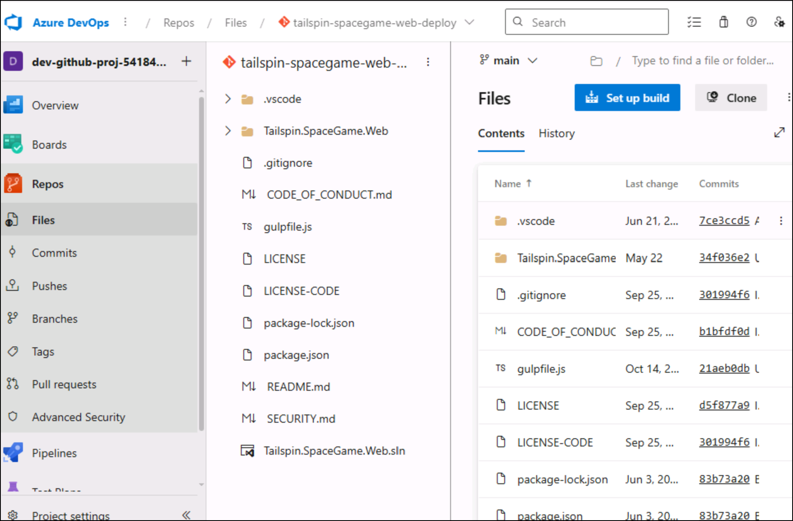

4.  Replace :pipeline_id with your pipline2 id in the below command and
    then run it.

gh actions-importer migrate azure-devops pipeline --pipeline-id
:pipeline_id --target-url https://github.com/:owner/:repo --output-dir
tmp/migrate

5.  The command will write the URL to the pull request that is created
    when the command succeeds.Open the generated pull request in a new
    browser tab.

6.  The first thing to notice about the pull request is that there is a
    list of manual steps to complete:

7.  Next, you can inspect the Files changed in this pull request to see
    the converted workflow that is being added. Any additional changes
    or code reviews that were needed should be done in this pull
    request.

8.  Finally, you can merge the pull request once your review has
    completed. You can then view the workflow running by selecting
    the Actions menu in the top navigation bar in GitHub.

At this point, the migration has completed and you have successfully
migrated an Azure DevOps pipeline to Actions.
