# Lab 06 - Migrate Azure DevOps Repositories and Deploy via Azure Pipelines using GitHub Enterprise Cloud

### Objective : 

In this lab, you will take on the role of a developer working on an
application in Azure DevOps who has been asked to move to GitHub
Enterprise Cloud while maintaining the CI/CD setup.

You will:

1.  Migrate the repository from Azure DevOps to GEC using the **gh
    ado2gh** migration tool.

2.  Create a service connection in Azure DevOps to the migrated GEC
    repository.

3.  Configure an Azure Pipeline that builds and deploys the application
    from the release-pipeline branch in GEC to Azure App Service.

4.  Push changes from your local repository to GEC to trigger the
    pipeline.

This lab uses a **realistic developer workflow** — you will be working
in a development branch (release-pipeline) and testing the build/deploy
process before merging into main.

### Important Note on PR Workflow

In a **real enterprise workflow**:

- Developers make changes in a feature or development branch.

- They commit and push changes to that branch in the remote repository
  (GEC).

- A **Pull Request (PR)** is created targeting the main branch.

- The PR undergoes review and must be approved before merging.

In this lab, we will **not** merge into main automatically.  
Instead, we will stop after confirming that our changes in
release-pipeline successfully build and deploy.  
You will practice the **PR review and approval process** in **Lab 8**,
where we simulate a fully automated and approved merge-to-main workflow.

## Exercise 1 - Set up your environment

In this lab, we are integrating a DevOps strategy into the processes. In
this section, you make sure that your environment reflects the team's
efforts so far.

To do this, you:

- Add a user to ensure Azure DevOps can connect to your Azure
  subscription.

- Set up an Azure DevOps project for this module.

- Add the build pipeline.

### Task 1 : Create an Azure DevOps personal access token

1.  Create an Azure DevOps personal access token (PAT). Open a new tab
    in your browser and navigate to - <https://portal.azure.com/> and
    sign in with assigned account.

2.  Search for **Azure DevOps** and select **Azure DevOps
    organizations**.

3.  Click on **My Azure DevOps Organization** hyper link.

4.  Click on **Create new organization** button.

5.  Click on **Continue**.

6.  Enter the organization name as : **tffabrikamXXX** (should be
    unique, replace XXX with number)enter the characters shown in your
    screen and then click on **Continue**.

7.  In the top right corner of the screen, click **User settings**.
    Click Personal access tokens.

8.  Select **+ New Token**

9.  Enter the name as : **devopstoken** and select Full access scope and
    then click on **Create**

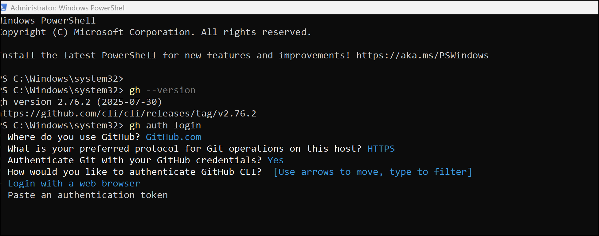

10. Copy the generated API token and save it in a safe location. For
    your security, it won't be shown again.

### Task 2 : Create GitHub personal access token

1.  Open GitHub in new browser tab and sign in with your GitHub account.

2.  Click on profile from right top corner and select **Settings**.

3.  Click on **Developer settings** from left navigation menu.

4.  Expand Persnal access tokens -\> Tokens(Classic). Click on Generate
    new token -\> Generate new token (classic)

> 

5.  Enter Note as : githubtoken and select all the scope items.

6.  Click on **Generate token**

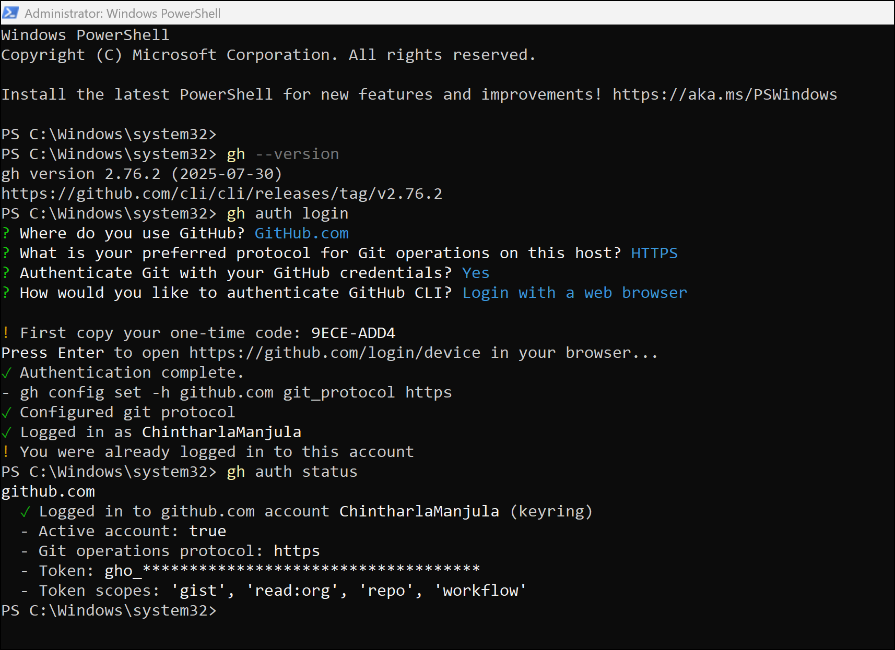

7.  Copy and save the token in a note pad to use in upcoming tasks.

### Task 2 : Download and configure the agent

8.  From Left down corner, click on **Organization settings**.

9.  Choose **Agent pools**. Select the **Default** pool.

10. Select the **Agents** tab, and choose **New agent**.

11. On the **Get the agent** dialog box, choose **Windows**. On the left
    pane, select the processor architecture of the installed Windows OS
    version on your machine. The x64 agent version is intended for
    64-bit Windows, whereas the x86 version is intended for 32-bit
    Windows. If you aren't sure which version of Windows is installed, 

12. On the right pane, click the **Download** button.

13. Follow the instructions on the page to download the agent.

14. Unpack the agent into the directory of your choice. Make sure that
    the path to the directory contains no spaces because tools and
    scripts don't always properly escape spaces. A recommended folder
    is C:\agents. Extracting in the download folder or other user
    folders may cause permission issues.

** Important**

We strongly recommend you configure the agent from an elevated
PowerShell window. If you want to configure as a service, this
is **required**. You must not use [**Windows PowerShell
ISE**](https://learn.microsoft.com/en-us/powershell/scripting/windows-powershell/ise/introducing-the-windows-powershell-ise) to
configure the agent.

** Important**

For security reasons we strongly recommend making sure the agents folder
(C:\agents) is only editable by admins.

** Note**

Please avoid using mintty based shells, such as git-bash, for agent
configuration. Mintty is not fully compatible with native Input/Output
Windows API
([**here**](https://github.com/mintty/mintty/wiki/Tips#inputoutput-interaction-with-alien-programs) is
some info about it) and we can't guarantee the setup script will work
correctly in this case.

### Task 3 : Configure and run the agent

1.  Start an elevated (PowerShell) window and set the location to where
    you unpacked the agent.

cd “C:\agents“

2.  Run config.cmd. This will ask you a series of questions to configure
    the agent. When setup asks for your server URL, for Azure DevOps
    Services, **answer https://dev.azure.com/{your-organization}.**

.\config.cmd

3.  The authentication method used for registering the agent is used
    only during agent registration. Press Enter accepting the
    Authentication method is PAT when prompts for -**Enter
    authentication type (press enter for PAT) and then enter your PAT
    and press Enter.**

> 

4.  Press Enter when prompts “**Enter agent pool (press enter for
    default)”**

5.  Type Agent name (**devopstogec**) of your choice and press Enter

6.  Press Enter when prompt “Enter work folder (press enter for \_work)”

7.  Just Enter when prompt s Enter run agent as service? (Y/N) (press
    enter for N) and Enter configure autologin and run agent on startup?
    (Y/N) (press enter for N)

8.  Run the following the command to start the agent.

.\run.cmd

9.  Minimize the window and continue with next tasks.

Note : To restart the agent, press Ctrl+C to stop the agent, and then
run **run.cmd** to restart it.

## Exercise 2 - Set up your Azure DevOps environment

In this section, you'll ensure that your Microsoft Azure DevOps
organization is set up to complete the rest of this module.

The modules in this learning path form a progression, in which you
follow the Tailspin web team through its DevOps journey.

### Task 1 : Get the Azure DevOps project

Here, you ensure that your Azure DevOps organization is set up to
complete the rest of this module. You do this by running a template that
creates a project for you in Azure DevOps.

1.  Open Visual Studio from Desktop and sign in with your accounts.

2.  Click on **Clone a repository**

3.  Enter Repository location as
    <https://github.com/microsoft/AzDevOpsDemoGenerator.git> and select
    location and then click on **Clone**.

4.  **Set ADOGenerator as the Startup Project** In Visual Studio.
    Right-click on the ADOGenerator project in the Solution Explorer.
    Select **Set as Startup Project**.

> 

5.  **Build the Solution** Build the solution to ensure all dependencies
    are restored and the project compiles successfully.

6.  In Visual Studio, **right-click on the solution in the Solution
    Explorer** and select **Build Solution.**

> Note : Alternatively, you can use the command line: dotnet build

7.  Wait for the build to complete.

8.  Run the Project To run the project as a console application. In
    Visual Studio**, press F5** or click on the **Start** button.

Note : Alternatively, you can run the project from the command line:

> **dotnet run --project src/ADOGenerator/ADOGenerator.csproj**
>
> 

9.  Enter **1** (Create a new project….)when prompted for options

10. When prompted to **Enter the template number from the list of
    templates**, enter **29** for **Create a release pipeline with Azure
    Pipelines**, then press **Enter**.

> 

11. Choose your authentication method as Personal Access Token (PAT).
    Type 2 and press Enter.

> 

** Note**

If you set up a PAT, make sure to authorize the
necessary [**scopes**](https://learn.microsoft.com/en-us/azure/devops/integrate/get-started/authentication/oauth#scopes).
For this module, you can use **Full access**, but in a real-world
situation, you should ensure you grant only the necessary scopes.

12. Enter your Azure DevOps organization name (eg :**tffabrikamXX**),
    then press **Enter**.

13. Enter your Azure DevOps PAT, then press **Enter**.

14. Enter a project name such as ***Space Game – web - Release***, then
    press **Enter**.

15. Once your project is created, go to your Azure DevOps organization
    in your browser
    (at https://dev.azure.com/\<your-organization-name\>/) and select
    the project.

### Task 2 : Fetch the branch from GitHu

1.  Open Visual Studio and click on Open Folder

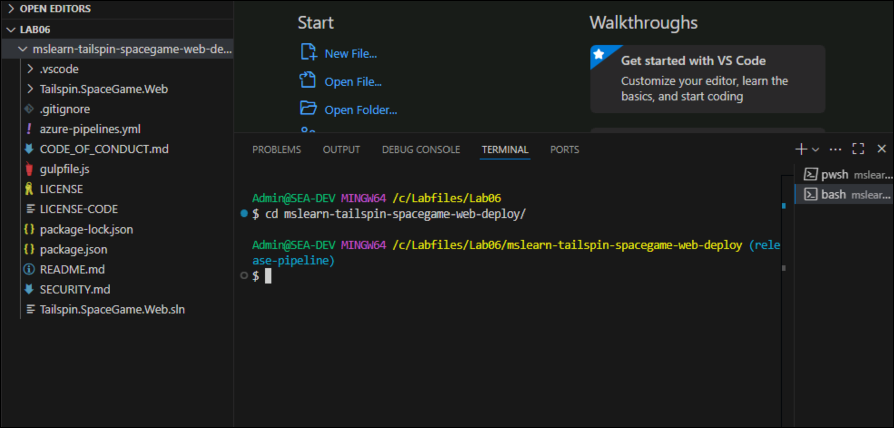

2.  Go to C:\Labfiles\Lab06 and select **s** folder

3.  Open Terminal and run below command to go the folder

cd mslearn-tailspin-spacegame-web-deploy

4.  A *remote* is a Git repository where team members collaborate (like
    a repository on GitHub). Here you list your remotes and add a remote
    that points to Microsoft's copy of the repository so that you can
    get the latest sample code.

5.  Run the following command to list your remotes:

git remote -v

6.  Origin specifies your repository on GitHub. When you fork code from
    another repository, the original remote (the one you forked from) is
    commonly named upstream.

7.  Run the following command to create a remote named *upstream* that
    points to the Microsoft repository:

> git remote add upstream
> https://github.com/MicrosoftDocs/mslearn-tailspin-spacegame-web-deploy.git
>
> git remote -v

8.  Run the following commands in new terminal to fetch
    the *release-pipeline* branch from the MicrosoftDocs repository, and
    check out a new branch *upstream/release-pipeline*.

> git fetch upstream release-pipeline
>
> git checkout -b release-pipeline upstream/release-pipeline

### Task 3 : Migrate Azure DevOps Repo to GitHub Enterprise Cloud

1.  Switch back to Visual Studio and run below commands to set
    environment varaibles. Make sure to update variables with your
    values and then run them.

export AZURE_DEVOPS_PAT="YOUR_AZDO_PAT"

export GH_PAT="ghp_xxxxxxxxxxxxxxxxxxxxx"

export ADO_ORG="https://dev.azure.com/your-ado-org" \# or simply
"your-ado-org" if you prefer

export GEC_ORG="your-githubEC-org" \# e.g. devopstogtihub

2.  Run below commands to verify GitHub login status. If not logged in
    then run 2^(nd) command gh auth login and follow the process to
    loginto GitHub.

gh auth status

gh auth login

3.  Run below command to grant migrator role to your account.(replace
    your-github-username with your username)

gh gei grant-migrator-role --github-org $GEC_ORG --actor
\<your-github-username\> --actor-type USER

eg :gh gei grant-migrator-role --github-org devopstogtihub --actor
chintharlamanjula --actor-type USER

4.  Replace **tffabrikam** with your Azure DevOps **org name** with your
    org url and run the command and **devopstogithub-org** with your
    GitHub **org name and run the command.**Copy the migration id to use
    it in the next step**.  
    (Note: We have used repo -** **tailspin-spacegame-web-deploy . You
    can check this in your ADO-\>Org-\> Project-\> Repo )**

gh ado2gh migrate-repo --ado-org tffabrikam --ado-team-project " **Space
Game - web - Release**" --ado-repo tailspin-spacegame-web-deploy
--github-org devopstogtihub --github-repo lab06-migrate-repos --ado-pat $AZURE_DEVOPS_PAT --github-pat $GH_PAT --queue-only

16. Copy repository migration and update below command with migration id
    and run.

gh ado2gh wait-for-migration --migration-id \<MIGRATION_ID\>
--github-pat $GH_PAT

17. Switch back to Github GEC -\> organization and you should see repo

### Task 4 : Create a Service Connection in Azure DevOps to GitHub Enterprise Cloud

1.  Switch back to ADO browser page,In **Azure DevOps** ,select your
    project.

2.  Click on **Project Settings**

3.  Click **Service connections -\> Create service connection.**

4.  Select **GitHub** and then click **Next.**

5.  Select **OAuth Configuration ; AzurePipelines** and then click on
    **Authorize** button. Sign in with your GitHub account.

6.  Keep the default connection name and select **Grant access
    permission to all pipelines** check box and then click on **Save**
    button.

7.  Click on **Service connections** from left navigation menu again.

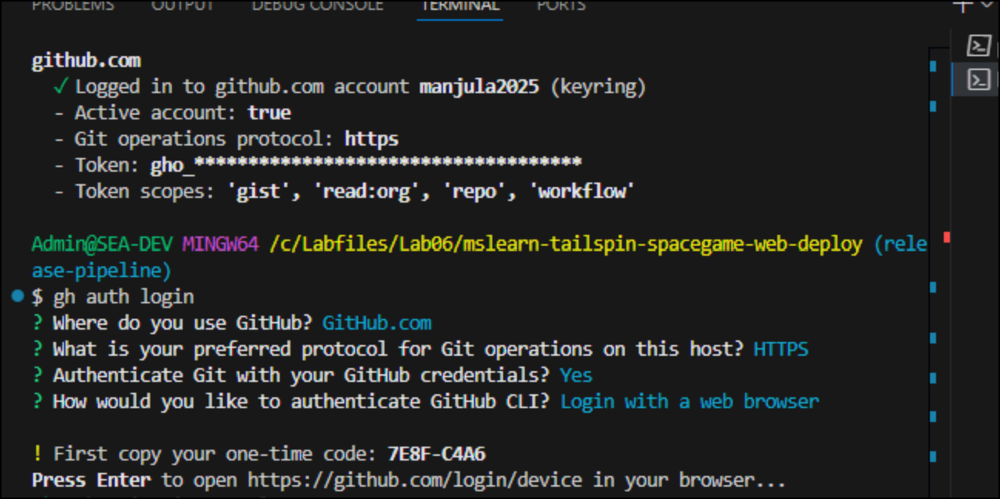

### Task 5: Update GitHub Authorization to Include GEC Organization

1.  Go to **GitHub.com** and log into your account. Navigate to
    **Profile -\>Settings**

2.  Click on **Applications** from left navigation menu under
    Integrations. 

3.  Click on **Authorized OAuth Apps tab** and then click on **Azure
    Pipelines (OAuth)**

> 

4.  Scroll down and under Organization access section, Click on Grant
    button next to your GEC organization.

### Task 6 : Run the Pipeline Against GEC Repo

Next, you'll manually trigger the pipeline to run. This step ensures
that your project is set up to build from your GitHub repository. The
initial pipeline configuration builds the application and produces a
builds artifact.

1.  Navigate to your project in Azure Devops, and then select project.

2.  Click on Pipelines from left navigation menu, select the pipeline
    and click **Edit** button as shown in below image

3.  Select **release-pipelines** branch. Replace the
    **Azure-pipeline.yml** code with below code and then click on
    **Validate and save**.

> trigger:
>
> \- '\*'
>
> pool:
>
>   name: 'Default'  # Self-hosted agent pool
>
> variables:
>
>   buildConfiguration: 'Release'
>
>   wwwrootDir: 'Tailspin.SpaceGame.Web/wwwroot'
>
>   dotnetSdkVersion: '8.x'
>
> steps:
>
> \- task: UseDotNet@2
>
>   displayName: 'Use .NET SDK $(dotnetSdkVersion)'
>
>   inputs:
>
>     packageType: sdk
>
>     version: '$(dotnetSdkVersion)'
>
> \- task: Npm@1
>
>   displayName: 'Run npm install'
>
>   inputs:
>
>     command: 'install'
>
>     verbose: false
>
> \- powershell: |
>
>     $scssPath = "$(wwwrootDir)/scss"
>
>     if (Test-Path $scssPath) {
>
>       Write-Host "SCSS directory found. Compiling..."
>
>       npx sass $scssPath:$(wwwrootDir)/css
>
>     } else {
>
>       Write-Host "SCSS directory not found. Skipping Sass
> compilation."
>
>     }
>
>   displayName: 'Compile Sass assets'
>
> \- script: 'npx gulp'
>
>   displayName: 'Run gulp tasks'
>
>   workingDirectory: Tailspin.SpaceGame.Web
>
> \- script: |
>
>     echo "$(Build.DefinitionName), $(Build.BuildId),
> $(Build.BuildNumber)" \> buildinfo.txt
>
>   displayName: 'Write build info'
>
>   workingDirectory: $(wwwrootDir)
>
> \- task: DotNetCoreCLI@2
>
>   displayName: 'Restore project dependencies'
>
>   inputs:
>
>     command: 'restore'
>
>     projects: '\*\*/\*.csproj'
>
> \- task: DotNetCoreCLI@2
>
>   displayName: 'Build the project - $(buildConfiguration)'
>
>   inputs:
>
>     command: 'build'
>
>     arguments: '--no-restore --configuration $(buildConfiguration)'
>
>     projects: '\*\*/\*.csproj'
>
> \- task: DotNetCoreCLI@2
>
>   displayName: 'Publish the project - $(buildConfiguration)'
>
>   inputs:
>
>     command: 'publish'
>
>     projects: '\*\*/\*.csproj'
>
>     publishWebProjects: false
>
>     arguments: '--no-build --configuration $(buildConfiguration)
> --output $(Build.ArtifactStagingDirectory)/$(buildConfiguration)'
>
>     zipAfterPublish: true
>
> \- task: PublishBuildArtifacts@1
>
>   displayName: 'Publish Artifact: drop'
>
>   inputs:
>
>     pathToPublish: '$(Build.ArtifactStagingDirectory)'
>
>     artifactName: 'drop'
>
>     publishLocation: 'Container'

4.  Click on **Save** button.

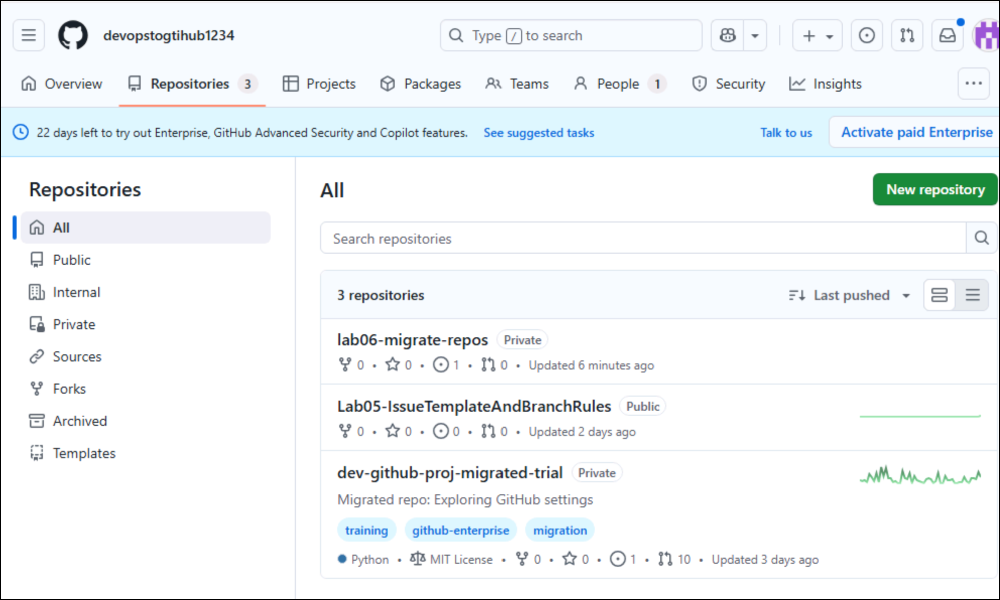

5.  Click on three dots next to **Run** and select **Triggers**.

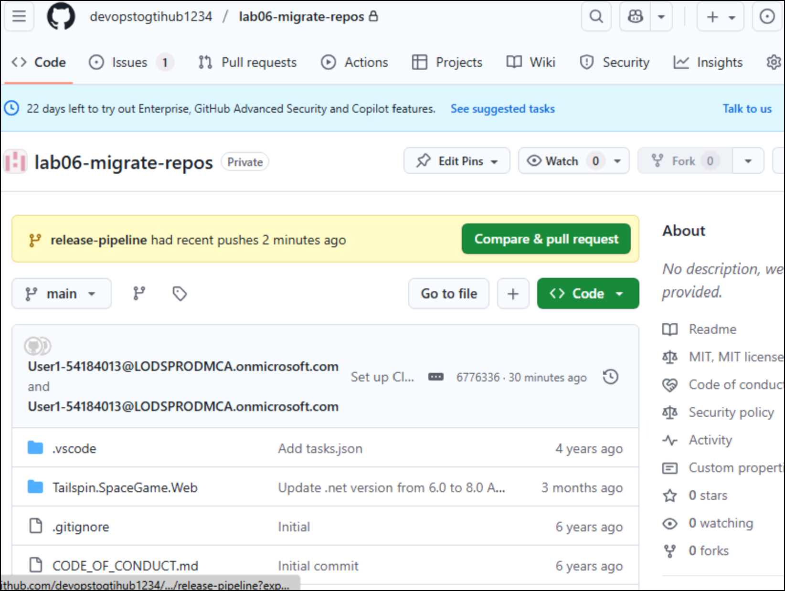

6.  Select **YAML** tab -\> Pipelines ,select **Default** for **Default
    agent pool for YAML.**

7.  Click on **Get sources**. Select **GtiHub** and then click next to
    **Repository**.

8.  Select the Lab06 repo form GEC organization and then click on
    **Select** button.

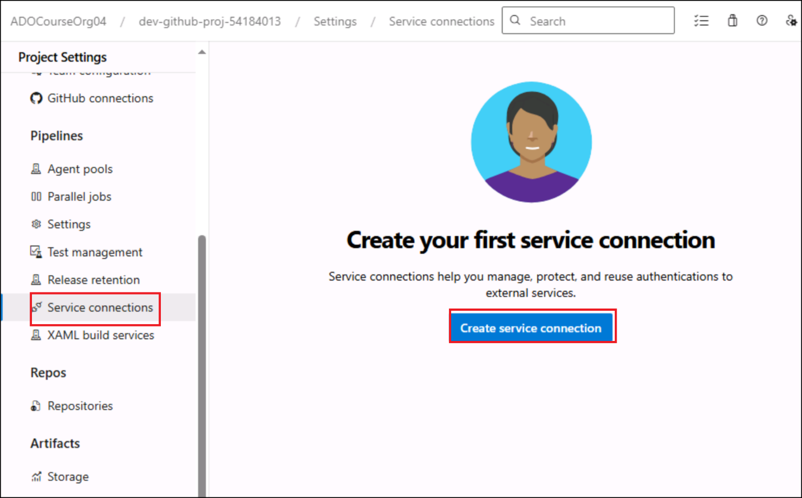

9.  Click on **Default branch for manual and scheduled builds** to
    select the branch.

10. Select **release-pipeline** branch and then click on **Select**
    button.

11. Click on **Save & queue -\> Save.**

12. Enter the comments and then click on **Save**.

13. Click on **Pipeline** from top navigation menu or from left
    navigation menu.

14. Select the pipeline which is in running status.

15. Click on the run.

> 

16. Click on **View** next to the warning message ”**This pipeline needs
    permission to access a resource before this run can continue**”

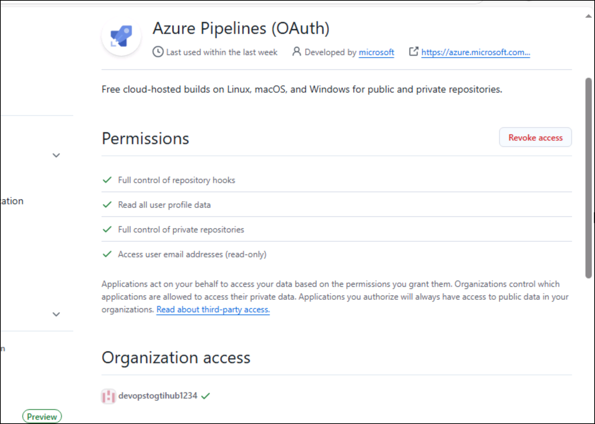

17. Click on **Permit-\> Permit** to permit access.

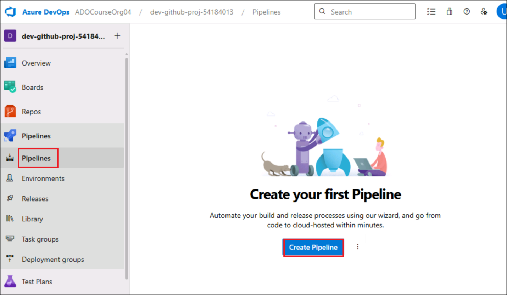

18. Wait for the job to success.

19. Select your published artifact.

20. The ***Tailspin.Space.Game.Web.zip*** is your build artifact. This
    file contains your built application and its dependencies.

> 

21. Click on **Pipelines** form left navigation menu and select the
    recent pipeline to **Edit**.

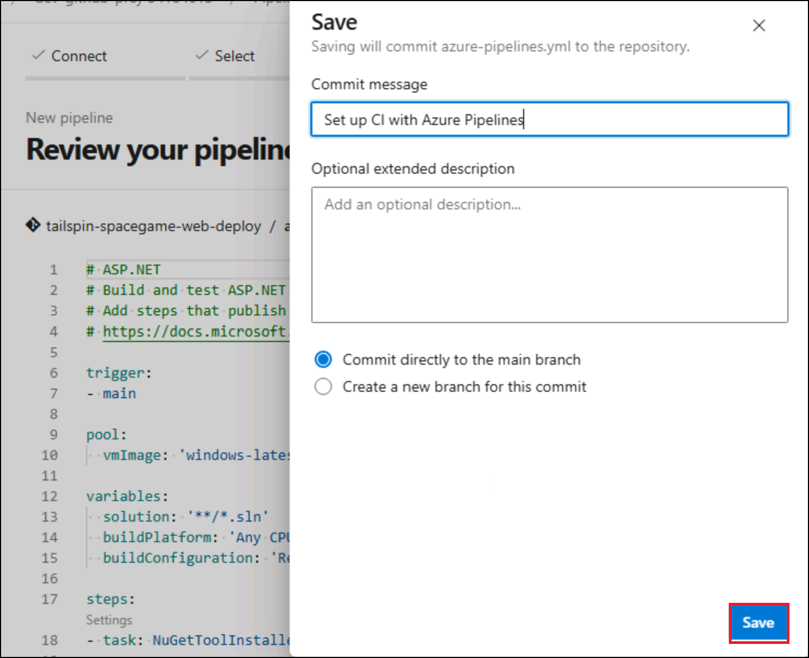

22. Select the release-pipeline branch and click on three dots next to
    **Run** and select **Triggers**

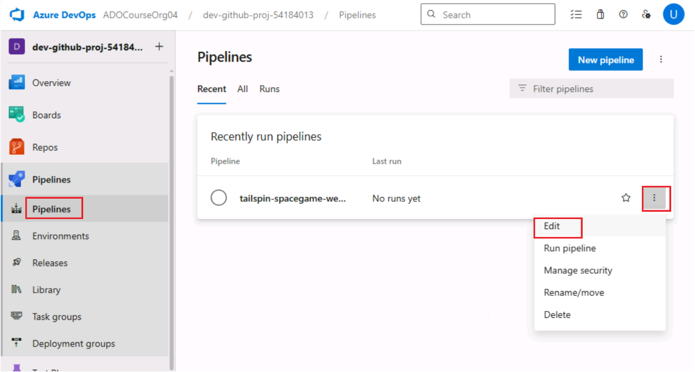

23. Select **Triggers-\> GEC-org/Lab06-migrate-repos**, select
    **Override the YAML continuous integration trigger from here** check
    box and then select **release-pipeline** branch as branch
    specification.

> 

24. Click on **Save & queue -\> Save**

25. Enter the comment and **Save**.

26. Replace the **azure-pipeline.yml** code with below code and then
    click on **Validate and save** button.

> trigger:
>
> \- '\*'
>
> pool:
>
>   name: 'Default'  # Self-hosted agent pool
>
> variables:
>
>   buildConfiguration: 'Release'
>
>   wwwrootDir: 'Tailspin.SpaceGame.Web/wwwroot'
>
>   dotnetSdkVersion: '8.x'
>
> steps:
>
> \- task: UseDotNet@2
>
>   displayName: 'Use .NET SDK $(dotnetSdkVersion)'
>
>   inputs:
>
>     packageType: sdk
>
>     version: '$(dotnetSdkVersion)'
>
> \- task: Npm@1
>
>   displayName: 'Run npm install'
>
>   inputs:
>
>     command: 'install'
>
>     verbose: false
>
> \- powershell: |
>
>     $scssPath = "$(wwwrootDir)/scss"
>
>     if (Test-Path $scssPath) {
>
>       Write-Host "SCSS directory found. Compiling..."
>
>       npx sass $scssPath:$(wwwrootDir)/css
>
>     } else {
>
>       Write-Host "SCSS directory not found. Skipping Sass
> compilation."
>
>     }
>
>   displayName: 'Compile Sass assets'
>
> \- script: 'npx gulp'
>
>   displayName: 'Run gulp tasks'
>
>   workingDirectory: Tailspin.SpaceGame.Web
>
> \- script: |
>
>     echo "$(Build.DefinitionName), $(Build.BuildId),
> $(Build.BuildNumber)" \> buildinfo.txt
>
>   displayName: 'Write build info'
>
>   workingDirectory: $(wwwrootDir)
>
> \- task: DotNetCoreCLI@2
>
>   displayName: 'Restore project dependencies'
>
>   inputs:
>
>     command: 'restore'
>
>     projects: '\*\*/\*.csproj'
>
> \- task: DotNetCoreCLI@2
>
>   displayName: 'Build the project - $(buildConfiguration)'
>
>   inputs:
>
>     command: 'build'
>
>     arguments: '--no-restore --configuration $(buildConfiguration)'
>
>     projects: '\*\*/\*.csproj'
>
> \- task: DotNetCoreCLI@2
>
>   displayName: 'Publish the project - $(buildConfiguration)'
>
>   inputs:
>
>     command: 'publish'
>
>     projects: '\*\*/\*.csproj'
>
>     publishWebProjects: false
>
>     arguments: '--no-build --configuration $(buildConfiguration)
> --output $(Build.ArtifactStagingDirectory)/$(buildConfiguration)'
>
>     zipAfterPublish: true
>
> \- task: PublishBuildArtifacts@1
>
>   displayName: 'Publish Artifact: drop'
>
>   inputs:
>
>     pathToPublish: '$(Build.ArtifactStagingDirectory)'
>
>     artifactName: 'drop'
>
>     publishLocation: 'Container'

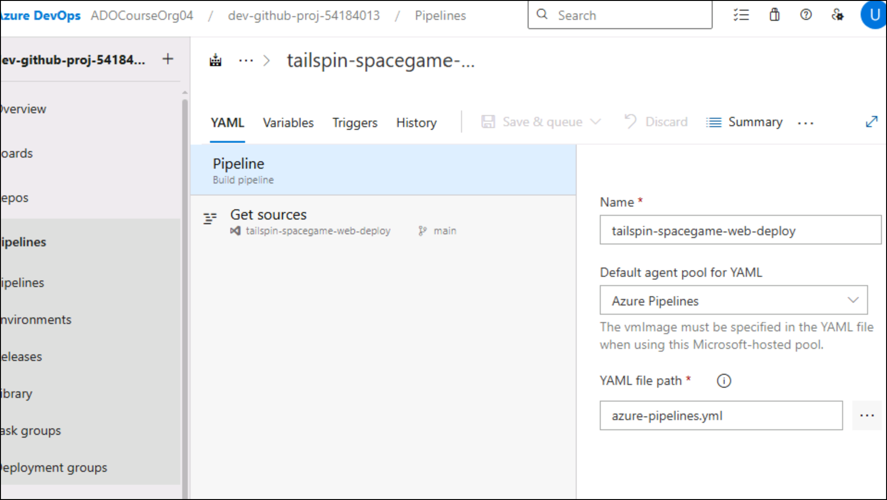

27. Click on **Save**.

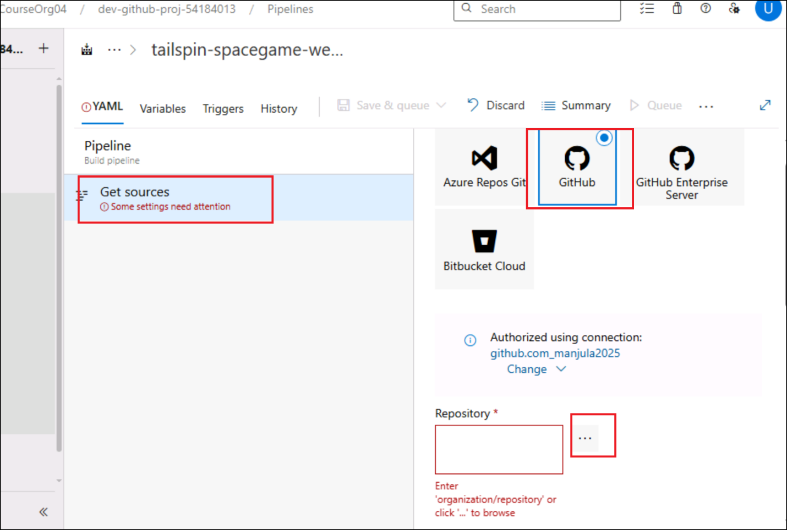

28. Click on **Run** button to run the pipeline.

29. In **Run pipeline** window, click on **Run**.

30. Click on the **Job**.

31. Wait for the job to run completely.

32. After the build finishes, select the back button to return to the
    summary page.

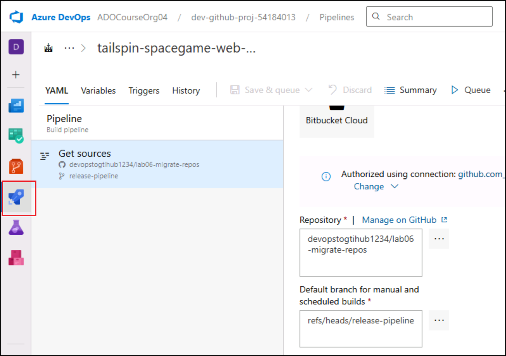

33. Select your **published** artifact.

34. The ***Tailspin.Space.Game.Web.zip*** is your build artifact. This
    file contains your built application and its dependencies.

You now have a build pipeline for the Space Game web project. Next,
you'll add a deployment stage to deploy your build artifact to Azure App
Service.

## Exercise 3 - Deploy the web application to Azure App Service

In this exercise, you create a multistage pipeline to build and deploy
your application to Azure App Service. You learn how to:

- Create an App Service instance to host your web application.

- Create a multistage pipeline.

- Deploy to Azure App Service.

### **Task 1: Create the App Service instance**

1.  Open a new tab in your browser and go to https://portal.azure.com
    and sign in with your Azure subscription.

2.  Search for  **App Services** and select it.

3.  Select **Create** \> **Web App** to create a new Web App.

4.  On the **Basics** tab, enter the following values. Select **Review +
    create**.

[TABLE]

> 
>
> 

5.  Select **Create**.

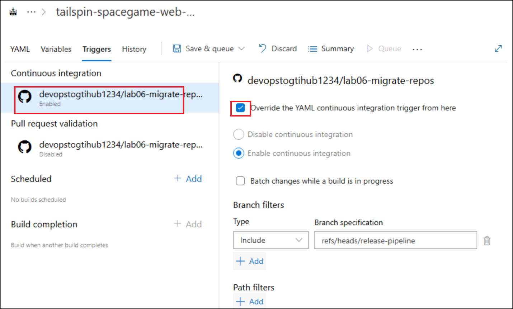

6.  The deployment takes a few moments to complete

7.  When deployment is complete, select **Go to resource**. The **App
    Service** Essentials displays details related to your deployment.

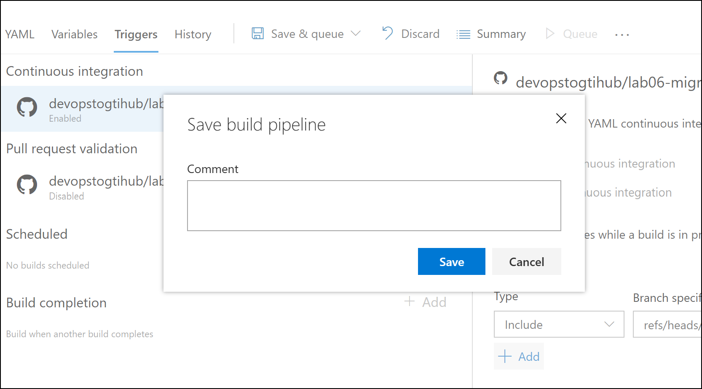

8.  Select the URL to verify the status of your App Service.

### Task 2 : Create a service connection

8.  Switch back to Azure DevOps tab, go to your **Space Game - web -
    Release** project.

9.  From the lower-left corner of the page, select **Project settings**.

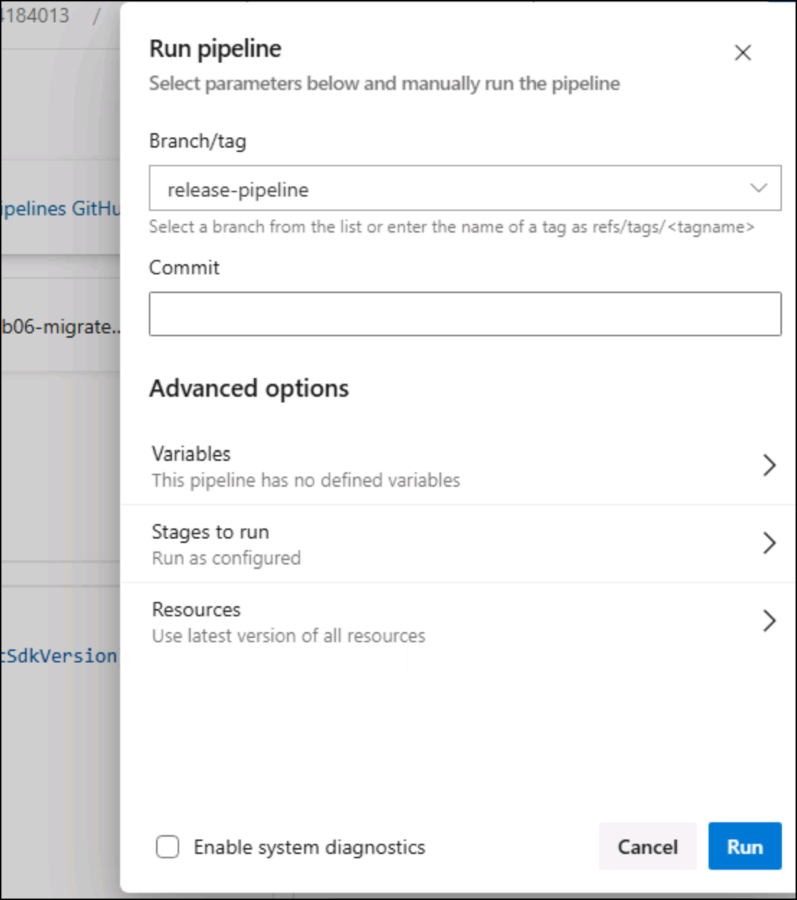

10. Under **Pipelines**, select **Service connections**. Select **New
    service connection**.

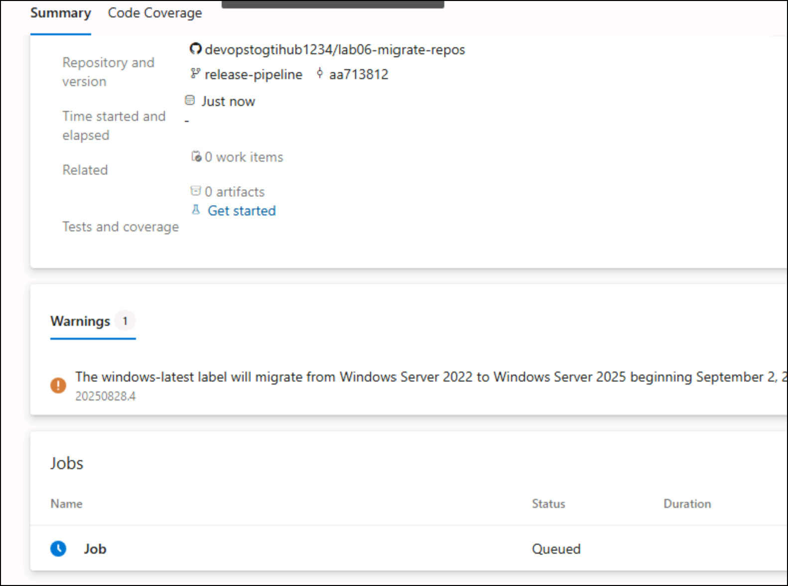

11. Select **Azure Resource Manager** then select **Next**.

12. Fill out the required fields as follows: If prompted, sign in to
    your Microsoft account.

    - Scope level : Subscription

    - Subscription : Your Azure subscription

    - Resource Group : **select your resource group.**

    - Service connection name : ***Resource Manager - Tailspin - Space
      Game***

> 

13. Ensure that **Grant access permission to all pipelines** is
    selected. Select **Save**.

> 

### Task 3 : Add the Build stage to your pipeline

A *multistage pipeline* allows you to define distinct phases that your
change passes through as it's promoted through the pipeline. Each stage
defines the agent, variables, and steps required to carry out that phase
of the pipeline. In this section, you define one stage to perform the
build. You define a second stage to deploy the web application to App
Service.

To convert your existing build configuration to a multistage pipeline,
you add a stages section to your configuration, and then you add one or
more stage sections for each phase of your pipeline. Stages break down
into jobs, which are a series of steps that run sequentially as a unit.

1.  Click on **Pipeline** from left navigation menu and then select
    three dots and select **Edit**

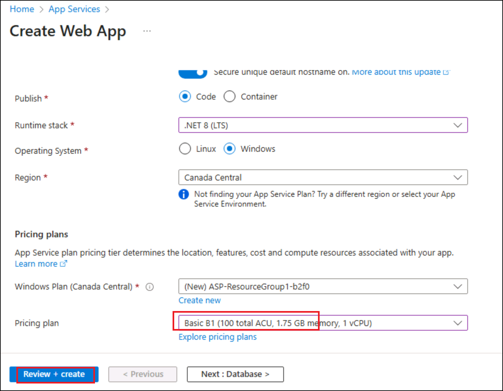

2.  Select **release-pipeline** branch and click next to **Run** button
    and then select **Triggers**.

3.  Switch back to Visual Studio code and replace the code
     ***azure-pipelines.yml*** with below code **save**:

> trigger:
>
> \- release-pipeline
>
> variables:
>
>   buildConfiguration: 'Release'
>
>   wwwrootDir: 'Tailspin.SpaceGame.Web/wwwroot'
>
>   dotnetSdkVersion: '8.x'
>
> stages:
>
> \- stage: Build
>
>   displayName: 'Build the web application'
>
>   jobs:
>
>   - job: BuildJob
>
>     displayName: 'Build job'
>
>     pool:
>
>       name: 'Default'  
>
>     steps:
>
>     - task: UseDotNet@2
>
>       displayName: 'Use .NET SDK $(dotnetSdkVersion)'
>
>       inputs:
>
>         packageType: sdk
>
>         version: '$(dotnetSdkVersion)'
>
>     - task: Npm@1
>
>       displayName: 'Run npm install'
>
>       inputs:
>
>         command: 'install'
>
>         verbose: false
>
>     - powershell: |
>
>         $scssPath = "$(wwwrootDir)/scss"
>
>         if (Test-Path $scssPath) {
>
>           Write-Host "SCSS directory found. Compiling..."
>
>           npx sass $scssPath:$(wwwrootDir)/css
>
>         } else {
>
>           Write-Host "SCSS directory not found. Skipping Sass
> compilation."
>
>         }
>
>       displayName: 'Compile Sass assets'
>
>     - script: 'npx gulp'
>
>       displayName: 'Run gulp tasks'
>
>       workingDirectory: Tailspin.SpaceGame.Web
>
>     - script: |
>
>         echo "$(Build.DefinitionName), $(Build.BuildId),
> $(Build.BuildNumber)" \> buildinfo.txt
>
>       displayName: 'Write build info'
>
>       workingDirectory: $(wwwrootDir)
>
>     - task: DotNetCoreCLI@2
>
>       displayName: 'Restore project dependencies'
>
>       inputs:
>
>         command: 'restore'
>
>         projects: '\*\*/\*.csproj'
>
>     - task: DotNetCoreCLI@2
>
>       displayName: 'Build the project - $(buildConfiguration)'
>
>       inputs:
>
>         command: 'build'
>
>         arguments: '--no-restore --configuration
> $(buildConfiguration)'
>
>         projects: '\*\*/\*.csproj'
>
>     - task: DotNetCoreCLI@2
>
>       displayName: 'Publish the project - $(buildConfiguration)'
>
>       inputs:
>
>         command: 'publish'
>
>         projects: '\*\*/\*.csproj'
>
>         publishWebProjects: false
>
>         arguments: '--no-build --configuration $(buildConfiguration)
> --output $(Build.ArtifactStagingDirectory)/$(buildConfiguration)'
>
>         zipAfterPublish: true
>
>     - task: PublishBuildArtifacts@1
>
>       displayName: 'Publish Artifact: drop'
>
>       inputs:
>
>         pathToPublish: '$(Build.ArtifactStagingDirectory)'
>
>         artifactName: 'drop'
>
>         publishLocation: 'Container'

4.  From the integrated terminal, run below command to fetch latest
    updates from GEC.

> git fetch origin
>
> 

5.  Run below command to merger remote changes into you local repo.

git checkout release-pipeline

git pull origin release-pipeline

6.  run below command to update origin to point to the migrated GEC repo

git remote set-url origin
<https://github.com/devopstogtihub/lab06-migrate-repos.git>

7.  Run the below command to push the origin.

git push origin release-pipeline

git remote -v

8.  From the integrated terminal, run the following commands to stage,
    commit, and then push your changes to your remote branch.

> git add azure-pipelines.yml
>
> git commit -m "Add a build stage"

git push origin release-pipeline

> 

9.  In Azure Pipelines, navigate to your pipeline to view the logs.

10. Select the pipeline run.

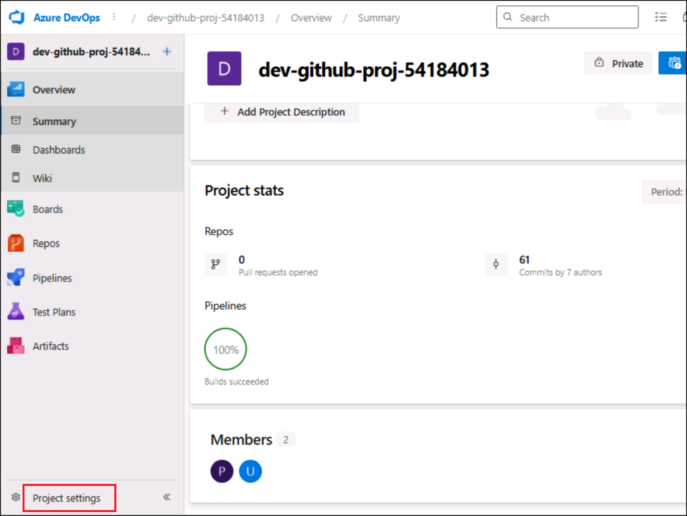

11. Click on **Build job**.

12. Wait for the build to complete successful.

13. After the build finishes, select the back button to return to the
    summary page and check the status of your pipeline and published
    artifact.

### Task 4 : Create the dev environment and Store your web app name in a pipeline variable

An *environment* is an abstract representation of your deployment
environment. You can use environments to define specific criteria for
your release, such as which pipeline is authorized to deploy to the
environment. You can also use environments to set up manual approvals
for specific user/group to approve before deployment is resumed.

The *Deploy* stage that we're creating uses the name to identify to
which App Service instance to deploy; for
example, *tailspin-space-game-web-1234*.

Although you could hard-code this name in your pipeline configuration,
defining it as a variable makes your configuration more reusable.

1.  From Azure Pipelines, select **Environments**.Make sure Dev
    environment got created .

> 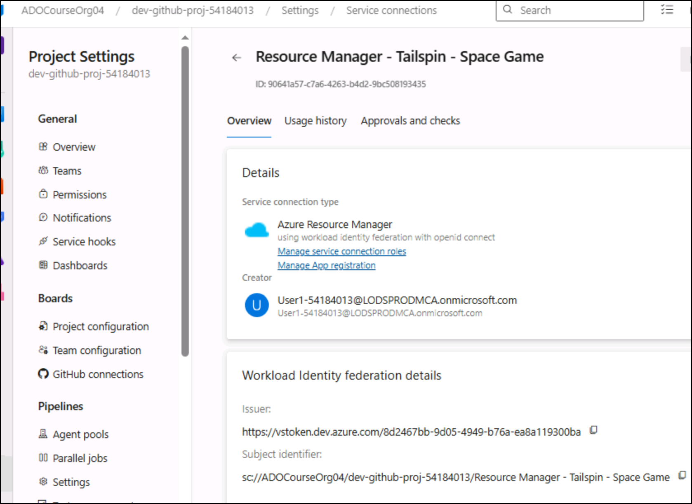

2.  In Azure DevOps, select **Pipelines** and then
    select **Library**.Select **+ Variable group** to create a new
    variable group.

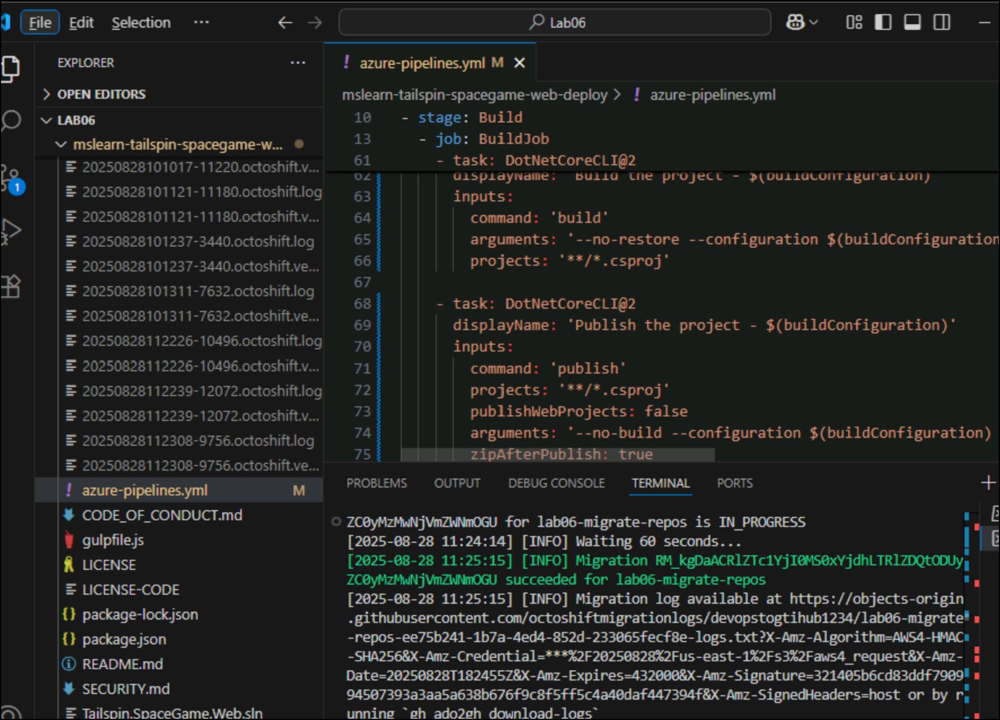

3.  Enter ***Release*** for the **variable group
    name**.Select **Add** under **Variables** to add a new variable.

> 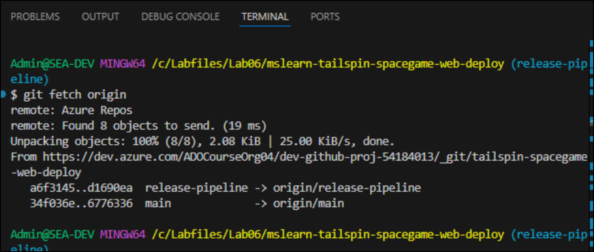

4.  Enter ***WebAppName*** for the variable name and your App Service
    instance's name for its value: for
    example, ***tailspin-space-game-web-***.(Webapp name you created in
    previous task-2s).Select **Save**.

### Task 5 : Add the deployment stage to your pipeline

We extend our pipeline by adding a deployment stage to deploy the *Space
Game* to App Service using the download and AzureWebApp@1 tasks to
download the build artifact and then deploy it.

1.  From Visual Studio Code, replace the contents
    of ***azure-pipelines.yml*** with the following yaml:

> trigger:
>
> \- '\*'
>
> variables:
>
>   buildConfiguration: 'Release'
>
>   wwwrootDir: 'Tailspin.SpaceGame.Web/wwwroot'
>
>   dotnetSdkVersion: '8.x'
>
> stages:
>
> \- stage: 'Build'
>
>   displayName: 'Build the web application'
>
>   jobs:
>
>   - job: 'Build'
>
>     displayName: 'Build job'
>
>     pool:
>
>       name: 'Default'  # Self-hosted agent pool
>
>     steps:
>
>     - task: UseDotNet@2
>
>       displayName: 'Use .NET SDK $(dotnetSdkVersion)'
>
>       inputs:
>
>         packageType: sdk
>
>         version: '$(dotnetSdkVersion)'
>
>     - task: Npm@1
>
>       displayName: 'Run npm install'
>
>       inputs:
>
>         command: 'install'
>
>         verbose: false
>
>     - powershell: |
>
>         $scssPath = "$(wwwrootDir)/scss"
>
>         if (Test-Path $scssPath) {
>
>           Write-Host "SCSS directory found. Compiling..."
>
>           npx sass $scssPath:$(wwwrootDir)/css
>
>         } else {
>
>           Write-Host "SCSS directory not found. Skipping Sass
> compilation."
>
>         }
>
>       displayName: 'Compile Sass assets'
>
>     - script: 'npx gulp'
>
>       displayName: 'Run gulp tasks'
>
>       workingDirectory: Tailspin.SpaceGame.Web
>
>     - script: |
>
>         echo "$(Build.DefinitionName), $(Build.BuildId),
> $(Build.BuildNumber)" \> buildinfo.txt
>
>       displayName: 'Write build info'
>
>       workingDirectory: $(wwwrootDir)
>
>     - task: DotNetCoreCLI@2
>
>       displayName: 'Restore project dependencies'
>
>       inputs:
>
>         command: 'restore'
>
>         projects: '\*\*/\*.csproj'
>
>     - task: DotNetCoreCLI@2
>
>       displayName: 'Build the project - $(buildConfiguration)'
>
>       inputs:
>
>         command: 'build'
>
>         arguments: '--no-restore --configuration
> $(buildConfiguration)'
>
>         projects: '\*\*/\*.csproj'
>
>     - task: DotNetCoreCLI@2
>
>       displayName: 'Publish the project - $(buildConfiguration)'
>
>       inputs:
>
>         command: 'publish'
>
>         projects: '\*\*/\*.csproj'
>
>         publishWebProjects: false
>
>         arguments: '--no-build --configuration $(buildConfiguration)
> --output $(Build.ArtifactStagingDirectory)/$(buildConfiguration)'
>
>         zipAfterPublish: true
>
>     - task: PublishBuildArtifacts@1
>
>       displayName: 'Publish Artifact: drop'
>
>       inputs:
>
>         pathToPublish: '$(Build.ArtifactStagingDirectory)'
>
>         artifactName: 'drop'
>
>         publishLocation: 'Container'
>
> \- stage: 'Deploy'
>
>   displayName: 'Deploy the web application'
>
>   dependsOn: Build
>
>   jobs:
>
>   - deployment: Deploy
>
>     pool:
>
>       name: 'Default'  # Self-hosted agent pool
>
>     environment: dev
>
>     variables:
>
>     - group: Release
>
>     strategy:
>
>       runOnce:
>
>         deploy:
>
>           steps:
>
>           - download: current
>
>             artifact: drop
>
>           - task: AzureWebApp@1
>
>             displayName: 'Azure App Service Deploy: website'
>
>             inputs:
>
>               azureSubscription: 'Resource Manager - Tailspin - Space
> Game'
>
>               appName: '$(WebAppName)'
>
>               package:
> '$(Pipeline.Workspace)/drop/$(buildConfiguration)/\*.zip'

Notice the highlighted section and how we're using
the download and AzureWebApp@1 tasks. The pipeline fetches
the $(WebAppName) from the variable group we created earlier.

Also notice how we're using environment to deploy to
the **dev** environment.

2.  From the integrated terminal, add *azure-pipelines.yml* to the
    index. Then commit the change and push it up to GitHub.

git add azure-pipelines.yml

git commit -m "Add a deployment stage"

git push origin release-pipeline

3.  In Azure Pipelines, navigate to your pipeline to view the logs.

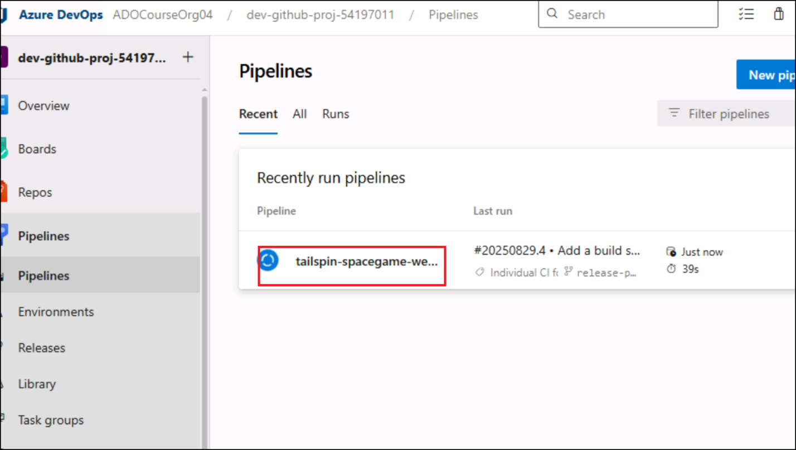

4.  Select deployment stage.

5.  Wait for the **Build** to complete.You will have manually permit
    Deployment to initiate the process

6.  Once build is successfully then click on View next to the warning
    message “  
    **This pipeline needs permission to access 2 resources before this
    run can continue to Deploy the web application”**

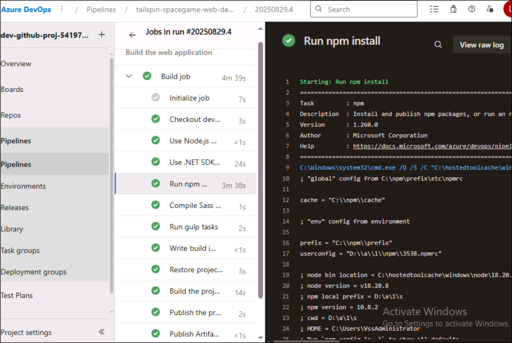

7.  Review and allow both permissions.

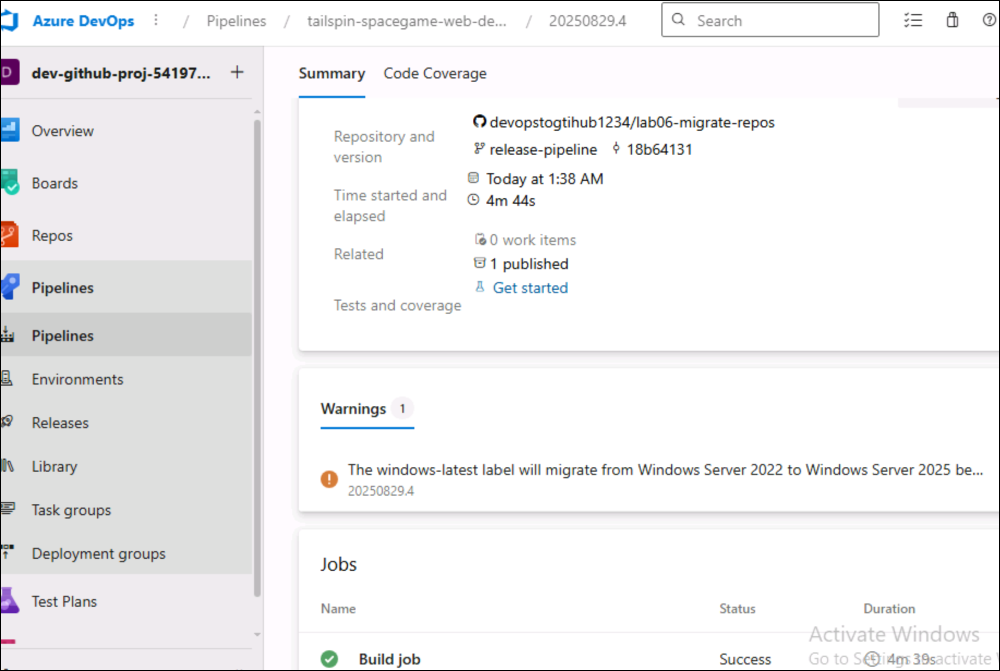

8.  Wait for the deployment to complete.

9.  After the build finishes, select the back button to return to the
    summary page and check the status of your stages. Both stages
    finished successfully in our case.

**Note:**  
In real-world scenarios, pipelines do not directly push changes to the
main branch.  
Instead, developers push changes to a feature or release branch (e.g.,
release-pipeline).  
The next step is to create a Pull Request (PR) to merge these changes
into main.  
This ensures that code changes go through review, approvals, and
automated checks before deployment.  
Directly pushing to main without review is generally avoided in
enterprise environments for compliance and quality control.

### Task 6 : View the deployed website on App Service

1.  Switch back to App Service tab open, refresh the page. Otherwise,
    navigate to your Azure App Service in the Azure portal and select
    the instance's **URL**: for
    example, ***https://tailspin-space-game-web-XXXXX.azurewebsites.net***

2.  The *Space Game* website is successfully deployed to Azure App
    Service.

## Exercise 4 - Clean up your environment

Congratulations! You're all done with creating pipelines and resources.
In this unit, you're going to clean up your Azure resources and Azure
DevOps environment.

### Task 1 : Clean up Azure resources

1.  Navigate to [Azure portal](https://portal.azure.com/).

2.  Select **Resource groups** from the left panel.

3.  Select your resource group (**tailspin-space-game-rg**).

4.  Select **Delete resource group**.

5.  Type your resource group name in the text box, and then
    select **Delete**.

6.  Select **Delete** again to confirm deletion.

### Task 2: Disable your pipeline

Each module in this learning path provides a template you can run to
create a clean environment. When you run multiple templates, you will
create multiple projects each pointing to the same GitHub repository.
This setup can trigger multiple pipelines to run every time you push a
change to your GitHub repository consuming free build minutes on our
hosted agents. That's why it's important to disable or delete your
pipeline before you move on to the next module in this learning path.

Choose this option if you want to keep your project and your build
pipeline for future reference. You can re-enable your pipeline later if
you need to.

1.  In your Azure DevOps project, select **Pipelines** and then select
    your pipeline.

2.  Select the ellipsis button at the far right, and then
    select **Settings**.

3.  Select **Disabled**, and then select **Save**. Your pipeline will no
    longer process new run requests.

### Task 3 : Delete your project

Choose this option if you don't need your DevOps project for future
reference. This will delete your Azure DevOps project.

1.  Navigate to your Azure DevOps project.

2.  Select **Project settings** in the lower-left corner.

3.  Under **Overview**, scroll down to the bottom of the page and then
    select **Delete**.

4.  Type your project name in the text box, and then select **Delete**.

## Summary

In this lab, we have

- Successfully migrated an Azure DevOps repository (with multiple
  branches) to GitHub Enterprise Cloud (GEC).

- Configured an Azure DevOps Pipeline to build and deploy code from a
  GEC branch to Azure App Service.

- Triggered a build and verified deployment using changes committed to
  the release-pipeline branch.

- Understood the value of separating **development branches** from main
  in CI/CD workflows.

- Learned why many organizations **require Pull Request approvals**
  before code merges into main, ensuring quality and security.

In this lab, we intentionally **did not automate merging changes into
main**.  
This was done to mirror real-world governance where:

1.  Developers push to a branch.

2.  A PR is created.

3.  Code is reviewed and approved.

4.  Only then is it merged into main.

We will practice this **end-to-end PR approval and merge process** in
**Lab 8**, including automation options for scenarios where governance
rules allow it.
